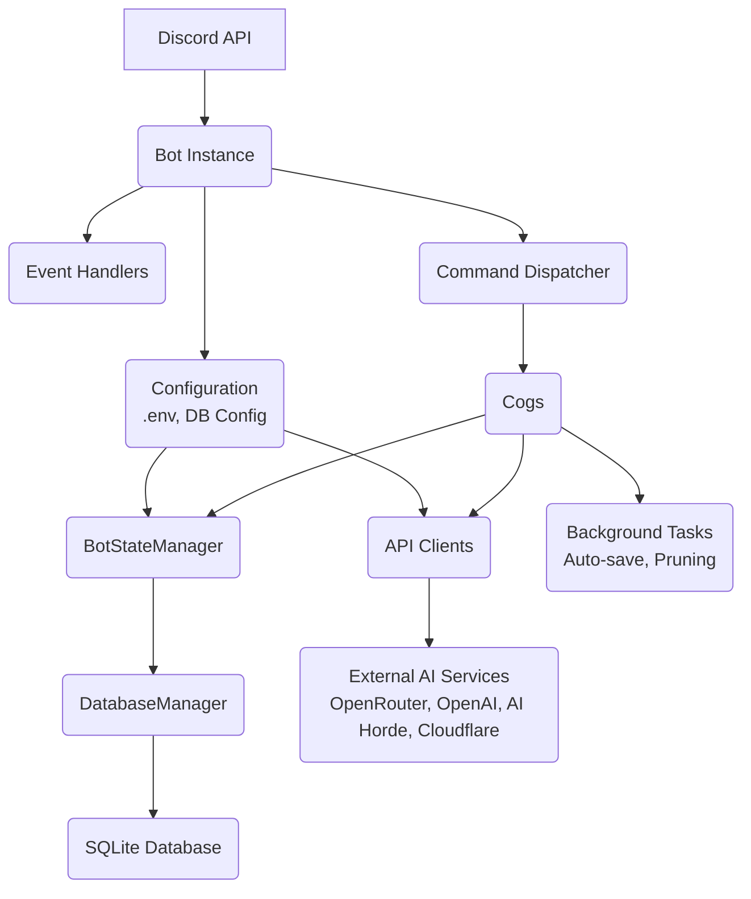

# Gideon - AI Assistant for Discord

## Project Overview

Gideon is a sophisticated Discord bot that serves as an AI-powered assistant, providing intelligent conversations, image generation, trivia games, reminders, and more. The bot integrates with multiple AI providers (OpenRouter, OpenAI, Anthropic Claude, Google Gemini) and image generation services (AI Horde, Cloudflare Workers, DALL-E, ComfyUI, OpenRouter).

**Tech Stack:**
- Python 3.8+
- Discord.py (Py-cord 2.4+)
- SQLite database
- Multiple AI provider APIs
- Docker support for deployment

## Architecture

### Architecture Diagram



### Core Components

#### 1. Bot Initialization (`src/bot.py`)
- Initializes Discord bot with proper intents (message content enabled)
- Sets up multiple AI provider clients (OpenRouter, OpenAI, AI Horde)
- Creates `ProviderManager` to handle switching between providers
- Initializes `BotStateManager` for centralized state/config management
- Loads cogs (command modules) dynamically
- Manages graceful shutdown with signal handlers

#### 2. Configuration (`src/config.py`)
Environment-based configuration loading:
- `DISCORD_TOKEN` - Discord bot authentication
- `OPENROUTER_API_KEY` - Primary AI provider
- `OPENAI_API_KEY` - Optional OpenAI/DALL-E access
- `AI_HORDE_API_KEY` - Optional AI Horde image generation
- `CLOUDFLARE_WORKER_URL` & `CLOUDFLARE_API_KEY` - Optional Cloudflare image gen
- `COMFYUI_URL` - Optional local ComfyUI server
- `SYSTEM_PROMPT` - Default AI personality
- `DEFAULT_MODEL` - Initial model (format: `provider/model-name`)
- `DATA_DIRECTORY` - Database and data storage location
- `INTENT_DISCOVERY` - Enable/disable AI intent detection for @mentions
- `INTENT_DETECTION_MODEL` - Model for intent classification
- `INTENT_CONFIDENCE_THRESHOLD` - Confidence threshold (0.0-1.0)
- `ENCRYPTION_MASTER_KEY` - Master key for Fernet encryption of API keys stored in DB (enables dashboard key management)
- `DASHBOARD_ENABLED` - Enable/disable web admin dashboard
- `DASHBOARD_PORT` - Dashboard server port (default: 8080)
- `DASHBOARD_SECRET` - Authentication secret for dashboard access

#### 3. State Management (`src/utils/state_manager.py`)
`BotStateManager` is the centralized hub for:
- Global configuration (model, provider, system prompt, memory limits)
- Channel-specific overrides (per-channel models/prompts)
- Thread-specific settings
- Database connection management
- Active conversation state tracking
- Model provider management

**Key Methods:**
- `get_global_model()`, `set_global_model()`
- `get_channel_config()`, `set_channel_config()`
- `get_thread_config()`, `set_thread_config()`
- `get_active_provider()` - Returns current AI provider client

#### 4. Provider Management (`src/utils/model_manager.py`)
`ProviderManager` handles multiple AI providers:
- Routes requests to appropriate provider (OpenRouter, OpenAI, AI Horde)
- Manages provider switching via `set_provider()`
- Handles fallback logic if a provider fails
- Validates model availability per provider

### Database Layer (`src/utils/database/`)

The database is modular, with separate managers for each domain:

#### Schema (`schema.py`)
Core tables:
- `GLOBAL_CONFIG` - Bot-wide settings (key-value store with type safety)
- `CHANNELS` - Discord channel metadata
- `CHANNEL_CONFIG` - Channel-specific AI overrides (model, provider, system prompt)
- `THREADS` - AI conversation threads (Discord native threads)
- `MESSAGES` - Conversation history (channel_id, thread_id, role, content, timestamp)
- `USERS` - User preferences (JSON storage)
- `REMINDERS` - Scheduled notifications (user, channel, due_timestamp, sent status)
- `TRIVIA_GAME_SESSIONS` - Active/historical trivia games
- `TRIVIA_LEADERBOARD` - Per-server user statistics (total games, points, streaks)
- `TRIVIA_ACHIEVEMENTS` - Unlockable badges (JSON metadata)
- `API_KEYS` - Encrypted API key storage (provider, encrypted_key, alias, validation_status, timestamps)
- `API_KEY_AUDIT` - Audit log for all key operations (created, updated, deleted, validated)

#### Database Managers
- `core.py` - `DatabaseManager` base class, connection pooling
- `config_manager.py` - Global config CRUD
- `channel_manager.py` - Channel config CRUD
- `thread_manager.py` - Thread config CRUD
- `message_manager.py` - Message history CRUD (supports filtering by time window)
- `user_manager.py` - User preferences
- `reminder_manager.py` - Reminder scheduling and retrieval
- `trivia_manager.py` - Trivia game state persistence
- `api_key_manager.py` - Encrypted API key CRUD and audit logging

### Command Modules (`src/cogs/`)

Each cog is a self-contained feature module loaded dynamically at startup:

1. **`admin_commands.py`** - Admin/owner-only tools
   - `/admin sync` - Sync slash commands
   - `/admin debug` - Show debug info
   - `/admin state` - Database state inspection
   - `/admin diagnostic` - System diagnostics
   - `/admin vision_models` - List vision-capable models

2. **`chat_commands.py`** - Core AI conversation features
   - `/chat` - Send message to AI (supports image uploads for vision models)
   - `/reset` - Clear channel conversation history
   - `/summarize` - Summarize current conversation
   - `/memory` - Show message count and history window

3. **`mention_commands.py`** - Handles @mentions of the bot
   - Detects user intent (conversation, reminder, image gen, search)
   - Routes to appropriate handler based on AI classification
   - Maintains conversation context across mentions
   - Supports image analysis via attachments

4. **`settings_commands.py`** - Global bot configuration (Admin)
   - `/settings show` - View all global settings
   - `/settings model` - Set global AI model
   - `/settings system` - Set global system prompt
   - `/settings provider` - Set global provider
   - `/settings memory` - Set message history limit
   - `/settings window` - Set time window for history (hours)
   - `/settings restore` - Reset to defaults

5. **`channel_commands.py`** - Channel-specific overrides (Admin)
   - `/channel show`, `/channel model`, `/channel system`, `/channel provider`
   - `/channel reset` - Clear channel overrides
   - `/channel list` - List all channels with custom configs

6. **`thread_commands.py`** - AI conversation threads
   - `/thread new` - Create dedicated AI thread (uses Discord native threads)
   - `/thread message` - Send message to specific thread
   - `/thread list`, `/thread show`, `/thread model`, `/thread system`
   - `/thread rename`, `/thread delete`
   - Auto-responds to all messages in AI threads

7. **`trivia_commands.py`** - AI-powered trivia game system
   - `/trivia start` - Solo or competitive mode, custom categories
   - `/trivia stop`, `/trivia stats`, `/trivia leaderboard`, `/trivia achievements`
   - Uses `src/utils/trivia_ai.py` for AI question generation
   - `src/utils/game_session.py` for in-memory game state
   - `src/utils/trivia_config.py` for scoring/achievements config

8. **`unified_image_commands.py`** - Unified image generation system
   - `/dream` - Generate images (routes to active provider)
   - `/dream_manage set_provider` - Switch image provider
   - `/dream_manage view_config` - Show active provider settings
   - `/dream_manage configure` - Provider-specific settings
   - `/dream_manage comfyui_*` - ComfyUI-specific admin commands

9. **`reminder_commands.py`** - Scheduled notifications
   - `/remind` - Create reminder with natural language parsing
   - `/reminders` - List active reminders
   - `/reminder_cancel` - Cancel reminder by ID
   - Background task checks for due reminders every 60s

10. **`url_commands.py`** - URL content extraction
    - `/summarizeurl` - Fetch and summarize webpage content
    - Auto-summarizes URLs posted in channels (if enabled)

11. **`help_commands.py`** - Interactive help system
    - `/help` - Browse commands by category with buttons
    - Auto-hides admin commands from non-admin users

12. **`dashboard_commands.py`** - Web admin dashboard
    - `/dashboard status` - Check dashboard server status
    - `/dashboard restart` - Restart dashboard server (owner only)
    - Starts aiohttp web server alongside the Discord bot
    - Broadcasts bot events to WebSocket clients for real-time monitoring

### Admin Dashboard (`src/utils/dashboard/`, `src/dashboard/`)

The admin dashboard is an optional web-based interface for managing all bot settings, channels, threads, and diagnostics. It serves as a full alternative to the Discord slash command interface.

#### Architecture
- **Backend**: aiohttp web server running in the same event loop as the Discord bot
- **Frontend**: Vanilla HTML/CSS/JS single-page application (no framework dependencies)
- **Auth**: Token-based session authentication via `DASHBOARD_SECRET`
- **Real-time**: WebSocket connection for live event streaming

#### Backend Components (`src/utils/dashboard/`)
- **`server.py`** - `DashboardServer` class
  - REST API endpoints for all CRUD operations (settings, channels, threads, diagnostics, API keys)
  - WebSocket handler for real-time event broadcasting
  - Serves static frontend files from `src/dashboard/`
  - API routes: `/api/overview`, `/api/settings`, `/api/channels`, `/api/threads`, `/api/messages`, `/api/models`, `/api/providers`, `/api/diagnostics`, `/api/keys`, `/api/keys/audit`, `/api/keys/import-env`
- **`auth.py`** - Authentication middleware
  - Session token generation and validation
  - Constant-time secret comparison
  - Cookie and Bearer token support

#### Frontend (`src/dashboard/`)
- **`index.html`** - Single-page dashboard with tab-based navigation
- **`css/dashboard.css`** - Dark theme responsive styles
- **`js/dashboard.js`** - Application logic (API calls, WebSocket, tab management)

#### Dashboard Tabs
1. **Overview** - Bot status, guild count, message/thread stats, uptime, latency, provider usage links, quick actions
2. **API Keys** - Encrypted API key management (add/edit/delete/validate keys, import from .env, audit log)
3. **Settings** - Global model, provider, system prompt, memory, intent detection
4. **Channels** - Channel-specific configuration overrides (edit/reset)
5. **Threads** - Thread management (rename, configure model/prompt, delete)
6. **Image Gen** - Image generation provider configuration
7. **Messages** - Browse stored conversation history (filter by channel/thread/role, paginated)
8. **Diagnostics** - Provider health checks, DB stats, manual prune trigger
9. **Live Activity** - Real-time WebSocket feed of bot events

### AI Provider Clients (`src/utils/`)

#### `openrouter_client.py` - OpenRouterClient
- Primary AI provider (supports 100+ models)
- Handles conversation context, system prompts
- Supports vision models (image analysis)
- Web search capability (via OpenRouter's search API)
- Model listing and availability checking

#### `openai_client.py` - OpenAIClient
- Direct OpenAI API integration
- Supports GPT-4, GPT-4o, DALL-E
- Conversation management
- Image generation (DALL-E 2/3)

#### `ai_horde_client.py` - AIHordeClient
- Distributed image generation (Stable Diffusion models)
- Kudos-based system (free tier available)
- Model listing and status checking

#### `cloudflare_client.py` - CloudflareClient
- Custom Cloudflare Worker integration for image gen
- User-provided worker URL (self-hosted)
- Optional API key authentication

#### `comfyui_client.py` - ComfyUIClient (if present)
- Local/remote ComfyUI server integration
- Custom workflow JSON support
- Advanced control over image generation pipelines

### Utilities

- **`encryption.py`** - `EncryptionManager` for Fernet encrypt/decrypt of API keys, with key masking for display
- **`api_key_service.py`** - `APIKeyService` orchestrates encryption, DB storage, validation, env fallback, and .env import. Used by `bot.py` (hot-swap at startup) and `server.py` (dashboard API endpoints)
- **`permissions.py`** - Role-based permission checks (is_admin, is_owner)
- **`trivia_ai.py`** - AI-powered question generation and answer validation
- **`trivia_config.py`** - Scoring formulas, achievement definitions
- **`game_session.py`** - In-memory trivia game state (not persisted to DB)
- **`intent_handlers/`** - Specialized handlers (dice, calculation, poll, translation, timezone, unit conversion, definition)

## Development Patterns

### Configuration Hierarchy

Three types of configuration:
- **Static** (env vars via `.env` / `config.py`): Loaded once at startup. Used for tokens, `DATA_DIRECTORY`, `ENCRYPTION_MASTER_KEY`, and initial defaults
- **Dynamic** (`GLOBAL_CONFIG` table): Modifiable at runtime via `/settings` commands, persisted in the database across restarts
- **API Keys** (`API_KEYS` table): Fernet-encrypted in the database, managed via the dashboard. DB keys take priority over `.env` values; `.env` is used as fallback

Runtime resolution order (most specific wins):
1. **Thread Settings** (via `/thread`) - Thread-specific configs
2. **Channel Overrides** (via `/channel`) - Per-channel customization
3. **Global Settings** (via `/settings`) - Default for all channels

### Conversation Context Management
- Messages are stored in `MESSAGES` table with timestamps
- History retrieval filters by:
  - Channel or thread ID
  - Time window (configurable via `/settings window`)
  - Message count limit (configurable via `/settings memory`)
- Context is built as `[{"role": "user|assistant|system", "content": "..."}]`

### Image Generation Flow
1. User runs `/dream prompt:"sunset over mountains"`
2. Command routes to `unified_image_commands.py`
3. Retrieves active provider from config DB
4. Calls provider-specific client (AI Horde, Cloudflare, OpenAI, ComfyUI, OpenRouter)
5. Provider generates/queues image
6. Bot posts result with embed (includes prompt, model, settings)

### Intent Detection (@mentions)
When `INTENT_DISCOVERY=TRUE`:
1. User @mentions bot: "@Gideon remind me in 2 hours to check logs"
2. `mention_commands.py` sends message to `INTENT_DETECTION_MODEL`
3. AI classifies intent: `reminder`, `image_generation`, `search`, or `conversation`
4. If confidence >= `INTENT_CONFIDENCE_THRESHOLD`, routes to handler
5. Otherwise, falls back to normal conversation

### Trivia Game Flow
1. `/trivia start category:"Science" difficulty:medium mode:competitive`
2. Creates game session in DB (`TRIVIA_GAME_SESSIONS`)
3. Spawns Discord thread for the game
4. `trivia_ai.py` generates questions via AI (formatted as multiple choice)
5. Posts question, starts timer
6. Listens for user answers in thread (simple text parsing: "A", "B", "C", "D")
7. Calculates score (base points × difficulty multiplier × speed bonus × streak multiplier)
8. Updates `TRIVIA_LEADERBOARD` stats
9. Checks for achievements (e.g., "Perfect Game", "Speed Demon")
10. Posts final results, closes game session

## Error Handling and Logging

Three-layer error handling strategy:
1. **Command-level**: `try/except` blocks in individual command functions catch specific exceptions and return user-friendly messages
2. **Cog-level**: `@commands.Cog.listener("on_application_command_error")` handlers catch errors from commands within that cog
3. **Global**: `@bot.event` error handler in `bot.py` catches any unhandled exceptions, preventing crashes

Logging uses Python's standard `logging` module:
- Each module uses `logging.getLogger(__name__)` for its own logger
- Levels: DEBUG, INFO, WARNING, ERROR, CRITICAL
- Tracebacks logged via `logger.exception()` for error diagnosis
- Output to console; Docker users view via `docker-compose logs -f`

## Security

- **API Keys**: Can be stored in `.env` (loaded via `config.py`) or encrypted in the database via the dashboard. Database keys use Fernet symmetric encryption (`src/utils/encryption.py`) with a master key from `ENCRYPTION_MASTER_KEY` env var. Keys are decrypted only at runtime when needed. The dashboard API never exposes raw or encrypted keys — only masked values (e.g., `sk-...xyz123`)
- **Key Resolution Priority**: Database keys (encrypted) take precedence over `.env` values. If no DB key exists, `.env` is used as fallback. This ensures backward compatibility
- **Audit Logging**: All API key operations (create, update, delete, validate) are logged in the `API_KEY_AUDIT` table
- **Permission Controls**: Enforced via Py-Cord decorators (`@commands.is_owner()`, `@commands.has_permissions(administrator=True)`)
- **Input Validation**: Command inputs and external API responses are validated to prevent injection or malformed data issues
- **Data Protection**: SQLite database stores conversation history; recommend filesystem-level encryption on the host. Automatic pruning (configurable via `time_window_hours` and `max_channel_history`) limits stored data volume

## Common Workflows

### Adding a New Command
1. Create or edit cog file in `src/cogs/`
2. Define command with `@discord.slash_command()` decorator
3. Access state via `ctx.bot.state_manager`
4. Access AI provider via `ctx.bot.model_manager.get_active_provider()`
5. Handle errors gracefully (respond with user-friendly messages)
6. Restart bot or use `/admin sync` to register new command

### Adding a New AI Provider
1. Create client class in `src/utils/` (e.g., `new_provider_client.py`)
2. Implement standard methods: `chat()`, `list_models()`, etc.
3. Add initialization in `src/bot.py`
4. Register with `ProviderManager` in `src/utils/model_manager.py`
5. Update config commands to support new provider
6. Update documentation

### Database Migration
1. Update `src/utils/database/schema.py` with new table/column
2. Add migration logic in `SchemaManager.initialize()` or separate migration method
3. Create corresponding manager class if needed
4. Update `BotStateManager` to expose new data if needed
5. Test migration on clean DB and existing DB

## Key Design Decisions

1. **SQLite for Persistence** - Simple, file-based, no external DB server needed
2. **Modular Database Managers** - Each domain (messages, reminders, trivia) has dedicated manager
3. **Provider Abstraction** - `ProviderManager` allows seamless switching between AI providers
4. **Discord Native Threads** - Leverage Discord's built-in threading for organization
5. **Environment-Based Config** - `.env` file for secrets and deployment-specific settings
6. **Graceful Degradation** - Missing API keys disable features but don't crash bot
7. **Docker-First Deployment** - Dockerfile + docker-compose.yml for easy deployment
8. **Intent Detection Opt-In** - Performance/cost optimization (disabled by default)
9. **Dashboard Opt-In** - Web dashboard disabled by default, runs in same event loop when enabled
10. **No Frontend Framework** - Dashboard uses vanilla JS to avoid build dependencies

## Important Files Reference

- **Entry Point**: `src/__main__.py`
- **Bot Core**: `src/bot.py`
- **Config**: `src/config.py`
- **State Management**: `src/utils/state_manager.py`
- **Database Schema**: `src/utils/database/schema.py`
- **AI Providers**: `src/utils/openrouter_client.py`, `src/utils/openai_client.py`
- **API Key Management**: `src/utils/encryption.py`, `src/utils/api_key_service.py`, `src/utils/database/api_key_manager.py`
- **Image Gen**: `src/cogs/unified_image_commands.py`
- **Trivia Logic**: `src/utils/trivia_ai.py`, `src/cogs/trivia_commands.py`
- **Dashboard Server**: `src/utils/dashboard/server.py`
- **Dashboard Frontend**: `src/dashboard/index.html`, `src/dashboard/js/dashboard.js`
- **Dashboard Cog**: `src/cogs/dashboard_commands.py`
- **Environment**: `.env` (create from `.env.example`)

## Testing & Debugging

- **Console Logs**: Bot outputs startup info, errors to stdout/stderr
- **Docker Logs**: `docker-compose logs -f` to tail container logs
- **Debug Commands**: `/admin debug`, `/admin state`, `/admin diagnostic`
- **Dashboard**: Enable `DASHBOARD_ENABLED=TRUE` and access `http://localhost:8080` for web-based management
- **Database Inspection**: Use SQLite browser on `{DATA_DIRECTORY}/gideon.db`
- **Intent Testing**: Enable `INTENT_DISCOVERY` and check logs for classification results

## Common Issues

1. **Commands Not Appearing** - Run `/admin sync` (owner only) to force command registration
2. **"Provider Not Available"** - Check API keys in `.env`, restart bot
3. **Image Gen Fails** - Verify provider-specific API key, check provider status page
4. **Reminders Not Firing** - Check background task is running (logs show "Checking for due reminders...")
5. **Database Locked** - Ensure only one bot instance is running, check file permissions on `DATA_DIRECTORY`

## Development Environment Setup

```bash
# Clone repo
git clone https://github.com/eoko-dev/gideon
cd gideon

# Create virtual environment
python3 -m venv venv
source venv/bin/activate  # Windows: venv\Scripts\activate

# Install dependencies
pip install -r requirements.txt

# Configure environment
cp .env.example .env
# Edit .env with your tokens/keys

# Run bot
python3 -m src
```

## Docker Deployment

```bash
# Build image
docker build -t gideon-bot:latest .

# Configure environment
cp .env.example .env
# Edit .env (set DATA_DIRECTORY=/app/data for Docker)

# Start with docker-compose
docker-compose up -d

# View logs
docker-compose logs -f

# Stop bot
docker-compose down
```

## Contributing Guidelines

- Follow existing code style (4-space indentation, descriptive variable names)
- Add docstrings to new functions/classes
- Update this CLAUDE.MD when adding new features or changing architecture
- Test locally before committing
- Ensure backward compatibility with existing database schema (add migrations if needed)

## Future Considerations

- Redis/PostgreSQL support for high-scale deployments
- Multi-server support (currently single-server focused)
- More intent handlers (code execution, math solver, etc.)
- Voice integration (TTS/STT)
- ~~Web dashboard for config management~~ (Implemented)
- Rate limiting per user/channel
- Advanced permission system beyond admin/non-admin

---

**Last Updated**: 2026-02-11
**Version**: Based on current main branch
**Maintainer**: eoko-dev
