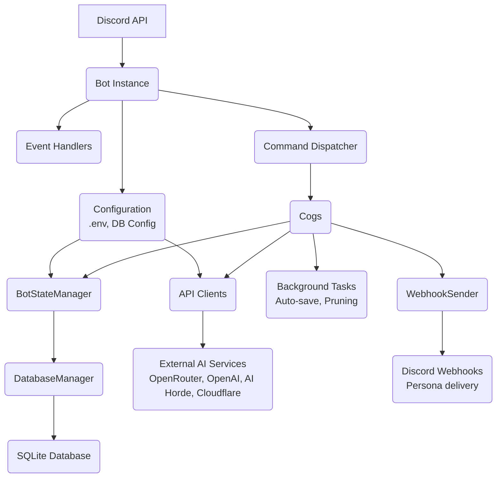

# Gideon - AI Assistant for Discord

## Project Overview

Gideon is a sophisticated Discord bot that serves as an AI-powered assistant, providing intelligent conversations, image generation, video generation, trivia games, reminders, per-channel personas, and more. The bot integrates with multiple AI providers (OpenRouter, OpenAI, Anthropic Claude, Google Gemini), image generation services (AI Horde, Cloudflare Workers, DALL-E, ComfyUI, OpenRouter), and video generation via OpenRouter (Veo 3.1, Sora 2 Pro, Seedance, Wan, Kling, etc.).

**Tech Stack:**
- Python 3.8+
- Discord.py (Py-cord 2.4+)
- SQLite database
- Multiple AI provider APIs
- Docker support for deployment

## Architecture

### Architecture Diagram



### Core Components

#### 1. Bot Initialization (`src/bot.py`)
- Initializes Discord bot with proper intents (message content enabled)
- Sets up multiple AI provider clients (OpenRouter, OpenAI, AI Horde)
- Creates `ProviderManager` to handle switching between providers
- Initializes `BotStateManager` for centralized state/config management
- Initializes `WebhookSender` for persona delivery
- Seeds built-in persona templates on startup
- Loads cogs (command modules) dynamically
- Manages graceful shutdown with signal handlers

#### 2. Configuration (`src/config.py`)
Environment-based configuration loading:
- `DISCORD_TOKEN` - Discord bot authentication
- `OPENROUTER_API_KEY` - Primary AI provider
- `OPENAI_API_KEY` - Optional OpenAI/DALL-E access
- `AI_HORDE_API_KEY` - Optional AI Horde image generation
- `CLOUDFLARE_WORKER_URL` & `CLOUDFLARE_API_KEY` - Optional Cloudflare image gen
- `COMFYUI_URL` - Optional local ComfyUI server
- `SYSTEM_PROMPT` - Default AI personality
- `DEFAULT_MODEL` - Initial model (format: `provider/model-name`)
- `DATA_DIRECTORY` - Database and data storage location
- `TOOL_CALLING_ENABLED` - Enable/disable native LLM tool calling for @mentions
- `TOOL_CALLING_MAX_ITERATIONS` - Max tool-call round-trips before forcing text response
- `INTENT_DISCOVERY` - (Deprecated) Backward compat alias for `TOOL_CALLING_ENABLED`
- `INTENT_DETECTION_MODEL` - (Deprecated) No longer used by tool-calling system
- `INTENT_CONFIDENCE_THRESHOLD` - (Deprecated) No longer used by tool-calling system
- `ENCRYPTION_MASTER_KEY` - Master key for Fernet encryption of API keys stored in DB
- `DASHBOARD_ENABLED` - Enable/disable web admin dashboard
- `DASHBOARD_PORT` - Dashboard server port (default: 8080)
- `DASHBOARD_SECRET` - Authentication secret for dashboard access

#### 3. State Management (`src/utils/state_manager.py`)
`BotStateManager` is the centralized hub for:
- Global configuration (model, provider, system prompt, memory limits)
- Channel-specific overrides (per-channel models/prompts)
- Thread-specific settings
- Persona lookups (`get_effective_persona()`)
- Database connection management
- Active conversation state tracking
- Model provider management

**Key Methods:**
- `get_global_model()`, `set_global_model()`
- `get_channel_config()`, `set_channel_config()`
- `get_thread_config()`, `set_thread_config()`
- `get_active_provider()` - Returns current AI provider client
- `get_effective_persona(channel_id)` - Returns active persona for a channel or None
- `get_effective_model(channel_id)` - Returns model, respecting persona model overrides
- `get_effective_system_prompt(channel_id)` - Returns resolved system prompt with channel memory block appended
- `get_effective_session_timeout(channel_id)` - Returns session timeout hours (channel override → global)
- `get_effective_memory_summary_enabled(channel_id)` - Returns bool (channel override → global)
- `get_effective_max_memory_summaries(channel_id)` - Returns summary cap (channel override → global)
- `get_channel_memories(channel_id, limit)` / `add_channel_memory(...)` / `prune_channel_memories(...)` - Memory CRUD delegation
- `reinitialize_state()` - Reloads all config from database (called after backup restore)

**Memory Config Keys** (`GLOBAL_CONFIG` table):
- `session_timeout_hours` (int, default 24) — Hours of silence before a channel session is considered expired
- `memory_summary_enabled` (bool, default True) — Whether expired sessions are auto-summarized before clearing
- `max_memory_summaries` (int, default 10) — Maximum number of memory summaries retained per channel

#### 4. Provider Management (`src/utils/model_manager.py`)
`ProviderManager` handles multiple AI providers:
- Routes requests to appropriate provider (OpenRouter, OpenAI, AI Horde)
- Manages provider switching via `set_provider()`
- Handles fallback logic if a provider fails
- Validates model availability per provider

### Database Layer (`src/utils/database/`)

The database is modular, with separate managers for each domain:

#### Schema (`schema.py`)
Core tables:
- `GLOBAL_CONFIG` - Bot-wide settings (key-value store with type safety)
- `CHANNELS` - Discord channel metadata
- `CHANNEL_CONFIG` - Channel-specific AI overrides (model, provider, system prompt)
- `THREADS` - AI conversation threads (Discord native threads)
- `MESSAGES` - Conversation history (channel_id, thread_id, role, content, timestamp)
- `USERS` - User preferences (JSON storage)
- `REMINDERS` - Scheduled notifications (user, channel, due_timestamp, sent status)
- `TRIVIA_GAME_SESSIONS` - Active/historical trivia games
- `TRIVIA_LEADERBOARD` - Per-server user statistics (total games, points, streaks)
- `TRIVIA_ACHIEVEMENTS` - Unlockable badges (JSON metadata)
- `API_KEYS` - Encrypted API key storage (provider, encrypted_key, alias, validation_status, timestamps)
- `API_KEY_AUDIT` - Audit log for all key operations
- `PERSONA_TEMPLATES` - Built-in and custom persona templates (name, display_name, avatar_url, system_prompt, model, is_builtin)
- `CHANNEL_PERSONAS` - Per-channel persona configuration (display_name, avatar_url, system_prompt, model_override, webhook_id, webhook_token, is_active)
- `CHANNEL_MEMORY` - Long-term per-channel memory summaries (channel_id, summary, message_count, conversation_start, created_at); not pruned by the time-window prune — persists until `max_memory_summaries` cap or manual deletion

#### Database Managers
- `core.py` - `DatabaseManager` orchestrator; delegates to all sub-managers
- `config_manager.py` - Global config CRUD
- `channel_manager.py` - Channel config CRUD
- `thread_manager.py` - Thread config CRUD
- `message_manager.py` - Message history CRUD (supports filtering by time window)
- `user_manager.py` - User preferences
- `reminder_manager.py` - Reminder scheduling and retrieval
- `trivia_manager.py` - Trivia game state persistence
- `api_key_manager.py` - Encrypted API key CRUD and audit logging
- `persona_manager.py` - Persona template and channel persona CRUD
- `backup_manager.py` - Config JSON export/import/validation and SQLite backup/restore
- `memory_manager.py` - Long-term channel memory CRUD (`get_memories`, `add_memory`, `delete_memories`, `prune_memories`, `get_all_memory_stats`)

### Command Modules (`src/cogs/`)

Each cog is a self-contained feature module loaded dynamically at startup:

1. **`admin_commands.py`** - Admin/owner-only tools
   - `/admin sync`, `/admin debug`, `/admin state`, `/admin diagnostic`, `/admin vision_models`

2. **`chat_commands.py`** - Core AI conversation features
   - `/chat`, `/reset`, `/summarize`, `/memory`
   - Checks for active persona per channel and routes responses through `WebhookSender`

3. **`mention_commands.py`** - Handles @mentions of the bot
   - Uses native LLM tool calling (when `TOOL_CALLING_ENABLED=TRUE`)
   - The primary model receives tool definitions and decides natively whether to call a tool (reminder, image generation, calculation, translation, etc.) or respond conversationally
   - Eliminates the need for a separate intent classification LLM call
   - Tool definitions are managed in `src/utils/tool_registry.py`
   - Maintains conversation context across mentions
   - Supports image analysis via attachments

4. **`settings_commands.py`** - Global bot configuration (Admin)
   - `/settings show`, `/settings model`, `/settings system`, `/settings provider`
   - `/settings memory`, `/settings window`, `/settings restore`
   - Hidden from Discord when dashboard is enabled

5. **`channel_commands.py`** - Channel-specific overrides (Admin)
   - `/channel show`, `/channel model`, `/channel system`, `/channel provider`, `/channel reset`, `/channel list`
   - Hidden from Discord when dashboard is enabled

6. **`thread_commands.py`** - AI conversation threads
   - `/thread new`, `/thread message`, `/thread list`, `/thread show`
   - `/thread model`, `/thread system`, `/thread rename`, `/thread delete`
   - Auto-responds to all messages in AI threads
   - Routes responses through `WebhookSender` if channel has active persona

7. **`trivia_commands.py`** - AI-powered trivia game system
   - `/trivia start`, `/trivia stop`, `/trivia stats`, `/trivia leaderboard`, `/trivia achievements`

8. **`unified_image_commands.py`** - Unified image generation
   - `/dream` - Generate images (routes to active provider)
   - `/dream_manage set_provider`, `/dream_manage view_config`, `/dream_manage configure`, `/dream_manage comfyui_*`

9. **`video_commands.py`** - AI video generation via OpenRouter
   - `/video` - Generate a video from a text prompt; per-invocation overrides for `model` (autocompleted), `duration`, `aspect_ratio`, `resolution` (480p, 720p, 1080p, 2K, or 4K), `audio`, `seed`, and `image_url` (image-to-video)
   - `/video_manage view_config`, `/video_manage models`, `/video_manage configure` (Admin; hidden when dashboard is enabled)
   - Discord model autocomplete is populated from the bot's existing OpenRouter `/models` metadata cache by filtering models whose `output_modalities` include `video` or whose `modality` output side contains `video`; autocomplete never starts its own network request or background task
   - Submits to OpenRouter's async `/api/v1/videos` API, polls every 15s with status updates, then attaches the result (≤25 MB) or links the unsigned URL
   - Persists results as `[video:url]` markers in message history for dashboard playback

10. **`reminder_commands.py`** - Scheduled notifications
   - `/remind`, `/reminders`, `/reminder_cancel`
   - Background task checks for due reminders every 60s

11. **`dashboard_commands.py`** - Web admin dashboard management
    - `/dashboard status`, `/dashboard restart`

12. **`persona_commands.py`** - Per-channel persona management (Admin)
    - `/persona set` - Set custom persona (display_name, avatar_url, system_prompt, model_override)
    - `/persona template` - Apply a built-in or custom template to this channel
    - `/persona view` - View current channel persona
    - `/persona list` - List all channels with configured personas
    - `/persona templates` - Browse all available templates
    - `/persona toggle` - Enable or disable persona without removing it
    - `/persona remove` - Remove persona from channel
    - `/persona preview` - Send a test webhook message with current persona

13. **`url_commands.py`** - URL summarization (`/summarizeurl`)

14. **`help_commands.py`** - Interactive `/help` command with category navigation

### Persona System

#### WebhookSender (`src/utils/webhook_sender.py`)
Manages the full webhook lifecycle for persona delivery:
- **Three-tier webhook lookup**: memory cache → DB credentials → Discord API scan → create new
- **Async locking**: prevents race conditions when multiple messages target the same channel
- **Thread support**: uses parent channel for threads, passing the thread as the `thread` param to Discord's webhook API
- **Fallback**: if webhook creation fails (missing `Manage Webhooks` permission), silently falls back to bot account
- **Cache invalidation**: `invalidate_cache(channel_id)` clears a channel's cached webhook (called after persona toggle/remove)

**Webhook Resolution Flow:**
1. Check `self._webhook_cache[channel_id]`
2. If miss, check DB for stored `webhook_id` / `webhook_token`
3. If no DB credentials, scan channel's existing webhooks for one created by the bot
4. If none found, create a new webhook and persist credentials to DB
5. Return `None` on `discord.Forbidden` → triggers fallback to bot account

#### Persona Templates (`src/utils/persona_templates.py`)
Defines built-in templates seeded on startup:
- `helpful-assistant` — Helpful Assistant
- `tech-guru` — Tech Guru
- `creative-writer` — Creative Writer

Built-in templates cannot be deleted. Custom templates can be freely created and removed.

#### Chat Integration
Both `chat_commands.py` and `thread_commands.py` check for active personas before sending responses:
```python
persona = self.bot.state_manager.get_effective_persona(channel_id)
if persona:
    await self.bot.webhook_sender.send_response(channel, content, channel_id)
else:
    await ctx.respond(content)
```

### Backup & Restore System

#### BackupManager (`src/utils/database/backup_manager.py`)
Handles all backup and restore operations:

**Config Export (JSON)**
- Exports tables: `GLOBAL_CONFIG`, `CHANNELS`, `CHANNEL_CONFIG`, `PERSONA_TEMPLATES`, `CHANNEL_PERSONAS`, `USERS`
- Excludes: `API_KEYS`, `MESSAGES`, webhook credentials from `CHANNEL_PERSONAS`
- Includes schema version for compatibility validation on import

**Config Import (JSON)**
- Validates export type, version, and schema compatibility before applying
- Uses upsert patterns; preserves existing `webhook_id`/`webhook_token` on channel persona rows
- Wrapped in a database transaction — atomically succeeds or rolls back entirely
- Calls `state_manager.reinitialize_state()` after successful import

**SQLite Backup**
- Uses SQLite's online backup API (`sqlite3.Connection.backup()`) for a consistent snapshot
- Written to system temp directory, served as a file download, then cleaned up

**SQLite Restore**
- Validates magic bytes, expected tables, and row counts before applying
- Replaces current database file, then calls `state_manager.reinitialize_state()`

**File Size Limits** — 10 MB for JSON configs, 100 MB for SQLite backups

### Dashboard (`src/dashboard/`, `src/utils/dashboard/`)

#### Backend (`src/utils/dashboard/server.py`)
aiohttp web server running in the same event loop as the bot:
- Token-based authentication via `src/utils/dashboard/auth.py`
- WebSocket endpoint for real-time activity broadcasts
- REST API endpoints for all management operations

**Backup & Restore API Endpoints:**
- `GET /api/backup/config` — Export config as JSON
- `GET /api/backup/database` — Export full database backup
- `POST /api/backup/config/validate` — Validate JSON config before import
- `POST /api/backup/config/import` — Apply JSON config
- `POST /api/backup/database/validate` — Validate SQLite backup file
- `POST /api/backup/database/restore` — Restore from SQLite backup

**Video Generation API Endpoints:**
- `GET /api/video/settings` — Active provider, default config (model, duration, aspect_ratio, resolution, audio), availability flag
- `PUT /api/video/settings` — Update active provider and/or default config
- `GET /api/video/models` — Live video-output model list filtered from OpenRouter `/api/v1/models`; returns an error if OpenRouter is unavailable rather than serving stale hardcoded model data
- `POST /api/video/generate` — Submit a video generation job (returns `job_id`, `status`, `polling_url`)
- `GET /api/video/jobs/{job_id}` — Poll job status; returns `status` and `unsigned_urls`

**Persona API Endpoints:**
- `GET /api/personas/templates` — List all templates
- `POST /api/personas/templates` — Create custom template
- `PUT /api/personas/templates/{id}` — Update template
- `DELETE /api/personas/templates/{id}` — Delete template (rejects built-ins)
- `GET /api/personas/channels` — List all channel personas
- `POST /api/personas/channels/{channel_id}` — Set channel persona
- `POST /api/personas/channels/{channel_id}/apply-template` — Apply template to channel
- `PATCH /api/personas/channels/{channel_id}/toggle` — Toggle active state
- `DELETE /api/personas/channels/{channel_id}` — Remove channel persona

**Memory API Endpoints:**
- `GET /api/memory` — List all channels with stored memories (channel_id, count, latest summary date)
- `GET /api/memory/{channel_id}` — Get all summaries for a channel (id, summary, message_count, conversation_start, created_at)
- `DELETE /api/memory/{channel_id}` — Clear all memories for a channel
- `POST /api/memory/{channel_id}/summarize` — Manually trigger summarization of current history and clear it

The `GET/PUT /api/settings` and `GET/PUT /api/channels/{id}` endpoints also include the three memory config fields: `session_timeout_hours`, `memory_summary_enabled`, `max_memory_summaries` (per-channel values may be `null` to inherit global).

#### Frontend (`src/dashboard/`)
Single-page application with tab-based navigation:
- **Memory tab** — Overview table of all channels with memories; channel detail card showing summaries with `conversation_start` dates and message counts; Clear and Trigger Summarize actions per channel
- **Personas tab** — Template card grid, channel personas table, modal editor for create/edit
- **Video Gen tab** — Backend status, model picker with capability hints (resolutions, aspect ratios, durations, audio, image-to-video), defaults form, and a test-generation card that submits a job, polls every 5s, and embeds the resulting `<video>` inline
- **Backup & Restore tab** — Drag-and-drop upload zones, validation preview cards, confirmation modal for database restore

WebSocket events trigger real-time tab refreshes for `template_updated`, `persona_updated`, etc.

## Configuration System

Three-tier configuration system:
- **Static** (`.env`): Used for tokens, `DATA_DIRECTORY`, `ENCRYPTION_MASTER_KEY`, and initial defaults
- **Dynamic** (`GLOBAL_CONFIG` table): Modifiable at runtime via `/settings` commands; persisted in the database across restarts
- **API Keys** (`API_KEYS` table): Fernet-encrypted in the database, managed via the dashboard. DB keys take priority over `.env` values; `.env` is used as fallback

Runtime resolution order (most specific wins):
1. **Persona model override** — If channel has active persona with `model_override`
2. **Thread Settings** (via `/thread`) — Thread-specific configs
3. **Channel Overrides** (via `/channel`) — Per-channel customization
4. **Global Settings** (via `/settings`) — Default for all channels

## Common Workflows

### Adding a New Command
1. Create or edit cog file in `src/cogs/`
2. Define command with `@discord.slash_command()` decorator
3. Access state via `ctx.bot.state_manager`
4. Access AI provider via `ctx.bot.model_manager.get_active_provider()`
5. For persona-aware responses, call `ctx.bot.webhook_sender.send_response()` if persona is active
6. Handle errors gracefully (respond with user-friendly messages)
7. Restart bot or use `/admin sync` to register new command

### Adding a New AI Provider
1. Create client class in `src/utils/` (e.g., `new_provider_client.py`)
2. Implement standard methods: `chat()`, `list_models()`, etc.
3. Add initialization in `src/bot.py`
4. Register with `ProviderManager` in `src/utils/model_manager.py`
5. Update config commands to support new provider
6. Update documentation

### Database Migration
1. Update `src/utils/database/schema.py` with new table/column
2. Add migration logic in `SchemaManager.initialize()` or a separate migration method
3. Create a corresponding manager class if needed
4. Delegate new methods from `core.py` `DatabaseManager`
5. Update `BotStateManager` to expose new data if needed
6. Test migration on clean DB and existing DB

### Adding a Persona Template
Built-in templates are defined in `src/utils/persona_templates.py` and seeded on startup via `db_manager.seed_builtin_persona_templates()`. To add a new built-in:
1. Add entry to the templates list in `persona_templates.py`
2. Restart the bot — seeding is idempotent (uses INSERT OR IGNORE)

## Key Design Decisions

1. **SQLite for Persistence** - Simple, file-based, no external DB server needed
2. **Modular Database Managers** - Each domain has a dedicated manager; `core.py` delegates
3. **Provider Abstraction** - `ProviderManager` allows seamless switching between AI providers
4. **Webhook-First Personas** - Persona delivery via webhooks gives channels a distinct identity; bot account fallback ensures reliability without permissions
5. **Singleton Pattern** - `BotStateManager` and `WebhookSender` are singletons accessed via `bot.state_manager` and `bot.webhook_sender`
6. **Discord Native Threads** - Leverage Discord's built-in threading for organization; personas inherit from parent channels
7. **Environment-Based Config** - `.env` file for secrets and deployment-specific settings
8. **Graceful Degradation** - Missing API keys or permissions disable features but don't crash the bot
9. **Docker-First Deployment** - Dockerfile + docker-compose.yml for easy deployment
10. **Dashboard Opt-In** - Web dashboard disabled by default, runs in same event loop when enabled; hides redundant slash commands when active
11. **Transaction Safety** - Config imports use database transactions to ensure atomicity; partial imports never happen
12. **Backup Security** - API keys and raw webhook tokens are excluded from config exports; webhook credentials are re-applied from DB during import to avoid loss

## Error Handling and Logging

Three-layer error handling strategy:
1. **Command-level**: `try/except` blocks in individual command functions catch specific exceptions and return user-friendly messages
2. **Cog-level**: `@commands.Cog.listener("on_application_command_error")` handlers catch errors from commands within that cog
3. **Global**: `@bot.event` error handler in `bot.py` catches any unhandled exceptions, preventing crashes

Logging uses Python's standard `logging` module:
- Each module uses `logging.getLogger(__name__)` for its own logger
- Levels: DEBUG, INFO, WARNING, ERROR, CRITICAL
- Tracebacks logged via `logger.exception()` for error diagnosis
- Output to console; Docker users view via `docker-compose logs -f`

## Security

- **API Keys**: Can be stored in `.env` or encrypted in the database via the dashboard. Database keys use Fernet symmetric encryption (`src/utils/encryption.py`) with a master key from `ENCRYPTION_MASTER_KEY`. Keys are decrypted only at runtime when needed. The dashboard API never exposes raw or encrypted keys — only masked values (e.g., `sk-...xyz123`)
- **Key Resolution Priority**: Database keys (encrypted) take precedence over `.env` values
- **Audit Logging**: All API key operations (create, update, delete, validate) are logged in `API_KEY_AUDIT`
- **Webhook Credentials**: `webhook_id` and `webhook_token` are stored in the database but excluded from config JSON exports. They are re-applied automatically during config import to prevent loss of Discord integrations
- **Backup Security**: Config exports exclude API keys entirely. Full database backups include all data but should be treated as sensitive
- **Permission Controls**: Enforced via Py-Cord decorators (`@commands.is_owner()`, `@commands.has_permissions(administrator=True)`)
- **Input Validation**: Command inputs and external API responses are validated to prevent injection or malformed data issues

## Flows Reference

### Persona Response Flow
1. User sends message in a channel or AI thread
2. `chat_commands.py` / `thread_commands.py` checks `state_manager.get_effective_persona(channel_id)`
3. If persona is active, routes to `bot.webhook_sender.send_response(channel, content, channel_id)`
4. `WebhookSender` resolves or creates a webhook for the channel (three-tier lookup)
5. Response is sent via webhook with persona's `display_name` and `avatar_url`
6. If webhook fails, `WebhookSender` falls back to bot account standard send

### Backup Export Flow
1. Admin clicks "Export Config" or "Export Database" in dashboard Backup tab
2. Request hits `GET /api/backup/config` or `GET /api/backup/database`
3. `BackupManager.export_config_json()` or `create_sqlite_backup()` is called
4. File is streamed to client with appropriate `Content-Disposition` header
5. Temp files (for SQLite) are cleaned up after response

### Config Import Flow
1. Admin uploads JSON file to dashboard
2. `POST /api/backup/config/validate` — `BackupManager.validate_config_json()` returns preview
3. Dashboard shows validation preview; admin confirms
4. `POST /api/backup/config/import` — `BackupManager.import_config_json()` runs in a transaction
5. `state_manager.reinitialize_state()` reloads config from DB
6. WebSocket broadcasts `config_imported` event; dashboard refreshes

### Session Rotation & Channel Memory Flow
1. User sends a message to a channel (via `/chat` or @mention)
2. `check_and_rotate_session(channel_id, state, clients)` is called from `memory_service.py` **before** fetching history
3. The timestamp of the most recent stored message is compared to `session_timeout_hours`
4. If the session has expired **and** `memory_summary_enabled` is True **and** history has ≥ 3 messages:
   a. Existing channel memories are fetched and injected as context into the summarization prompt
   b. The LLM generates a 2–3 sentence summary of the old conversation
   c. The summary is stored in `CHANNEL_MEMORY` with the original `conversation_start` timestamp
   d. Memories are pruned to `max_memory_summaries`
5. Channel history is cleared; the new message starts a fresh session
6. On every subsequent LLM call, `get_effective_system_prompt(channel_id)` appends a `--- Channel Memory ---` block listing all stored summaries (oldest → newest), giving the model long-term context without inflating the live message window

### Native Tool Calling (@mentions)
When `TOOL_CALLING_ENABLED=TRUE` (or legacy `INTENT_DISCOVERY=TRUE`):
1. User @mentions bot: "@Gideon remind me in 2 hours to check logs"
2. `mention_commands.py` sends the message to the **primary LLM model** with tool definitions attached
3. The model decides natively whether to call a tool (`set_reminder`, `generate_image`, `web_search`, `calculate`, `translate`, `define`, `create_poll`, `convert_timezone`, `convert_units`, `roll_dice`, `schedule_event`) or respond conversationally
4. If the model requests tool calls, each tool is executed via `tool_registry.execute_tool()` and results are fed back to the model
5. The model generates a final text response incorporating the tool results
6. If tool calling is disabled, falls back to plain conversation (no tools)

**Key advantages over the old intent classification system:**
- Single LLM call instead of two (classification + response)
- No 320-line classification prompt — tool descriptions are compact
- No confidence threshold heuristic — the model decides natively
- Supports multi-tool requests (e.g., "calculate 15% of 250 and translate the result to French")
- Uses conversation context (the model sees chat history, so "translate that" works)

**Tool definitions** are managed in `src/utils/tool_registry.py`. To add a new tool:
1. Add a tool definition to `TOOL_DEFINITIONS` (OpenAI function schema format)
2. Add an execution function `_execute_new_tool()`
3. Add a dispatch case in `execute_tool()`

### Image Generation Flow
1. User runs `/dream prompt:"sunset over mountains"`
2. Command routes to `unified_image_commands.py`
3. Retrieves active provider from config DB
4. Calls provider-specific client (AI Horde, Cloudflare, OpenAI, ComfyUI, OpenRouter)
5. Bot posts result with embed (includes prompt, model, settings)

### Video Generation Flow
1. User runs `/video prompt:"a cat surfing a wave"` (with optional `model`, `duration`, `aspect_ratio`, `resolution`, `audio`, `seed`, `image_url` overrides)
2. `video_commands.py` merges overrides over the saved defaults from `video_config_openrouter` in `GLOBAL_CONFIG`
3. `OpenRouterVideoClient.submit_video()` POSTs to `/api/v1/videos` and returns a `job_id`
4. The cog calls `wait_for_completion(job_id)` which polls `/api/v1/videos/{id}` every 15s, editing the original Discord message with each new status (uses an `on_status` callback to throttle edits)
5. On terminal status `completed`, the bot downloads the first URL from `unsigned_urls` and either attaches the MP4 (≤25 MB) or posts the URL in an embed
6. A `[video:url]` marker is persisted to `MESSAGES` for dashboard playback
7. Dashboard test generation uses `POST /api/video/generate` followed by client-side polling of `GET /api/video/jobs/{id}` every 5s

**Database Keys:**
- `video_active_provider` (string) — `"openrouter"` (only provider currently)
- `video_config_openrouter` (json) — `{model, duration, aspect_ratio, resolution, audio}` defaults

**Model List Source:** `OpenRouterVideoClient.list_video_models()` calls OpenRouter's canonical `/api/v1/models` endpoint and filters entries whose `output_modalities` include `video` or whose `modality` output side contains `video`; it never fabricates fallback model data. Discord autocomplete reads the already-populated OpenRouter model cache and never starts its own network request or background task.

## Troubleshooting

- **Bot Offline** - Check process/container is running, verify `DISCORD_TOKEN`, check console logs
- **Personas Not Showing** - Ensure bot has `Manage Webhooks` permission in the channel; check logs for webhook creation errors; verify persona is active with `/persona view`
- **Webhook Fallback Happening** - Check `discord.Forbidden` errors in logs; grant `Manage Webhooks` permission
- **Restore Not Taking Effect** - Confirm `reinitialize_state()` completed without error; restart bot if state appears stale
- **Database Locked** - Ensure only one bot instance is running; check file permissions on `DATA_DIRECTORY`
- **Dashboard Not Accessible** - Verify `DASHBOARD_ENABLED=TRUE` and correct port; check no firewall blocking
- **Video Generation Times Out** - Polling caps at 15 minutes per job; for longer renders re-run with shorter duration / smaller resolution, or supply a `callback_url` upstream
- **Video Job Fails** - Run `/video_manage models` to confirm the model still exists; verify the requested duration / aspect ratio / resolution combo is in the model's `supported_*` lists

## Development Environment Setup

```bash
git clone https://github.com/eoko-dev/gideon
cd gideon

python3 -m venv venv
source venv/bin/activate  # Windows: venv\Scripts\activate
pip install -r requirements.txt

cp .env.example .env
# Edit .env with your tokens/keys

python3 -m src
```

## Docker Deployment

```bash
docker build -t gideon-bot:latest .

cp .env.example .env
# Edit .env (set DATA_DIRECTORY=/app/data for Docker)

docker-compose up -d
docker-compose logs -f
docker-compose down
```

## Contributing Guidelines

- Follow existing code style (4-space indentation, descriptive variable names)
- Add docstrings to new functions/classes
- Update this CLAUDE.MD when adding new features or changing architecture
- Test locally before committing
- Ensure backward compatibility with existing database schema (add migrations if needed)
- New database tables should have a corresponding manager class; delegate methods from `core.py`

## Future Considerations

- Redis/PostgreSQL support for high-scale deployments
- Multi-server support (currently single-server focused)
- More tool handlers (code execution, math solver, etc.)
- Voice integration (TTS/STT)
- ~~Web dashboard for config management~~ (Implemented in v1.1)
- ~~Per-channel personas with webhooks~~ (Implemented in v1.2)
- ~~Backup & restore~~ (Implemented in v1.2)
- ~~Video generation (OpenRouter `/api/v1/videos`)~~ (Implemented)
- ~~Channel memory system (session rotation + persistent summaries)~~ (Implemented in v1.3)
- Rate limiting per user/channel
- Advanced permission system beyond admin/non-admin
- Server templates/presets
- Streaming responses

---

**Last Updated**: 2026-06-28
**Version**: v1.4
**Maintainer**: eoko-dev
