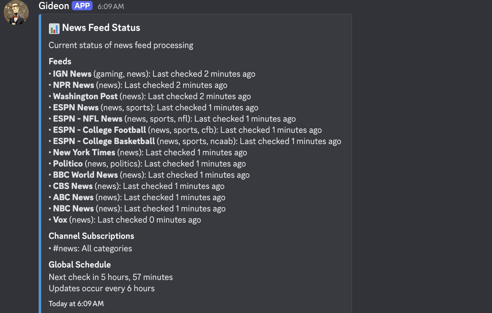
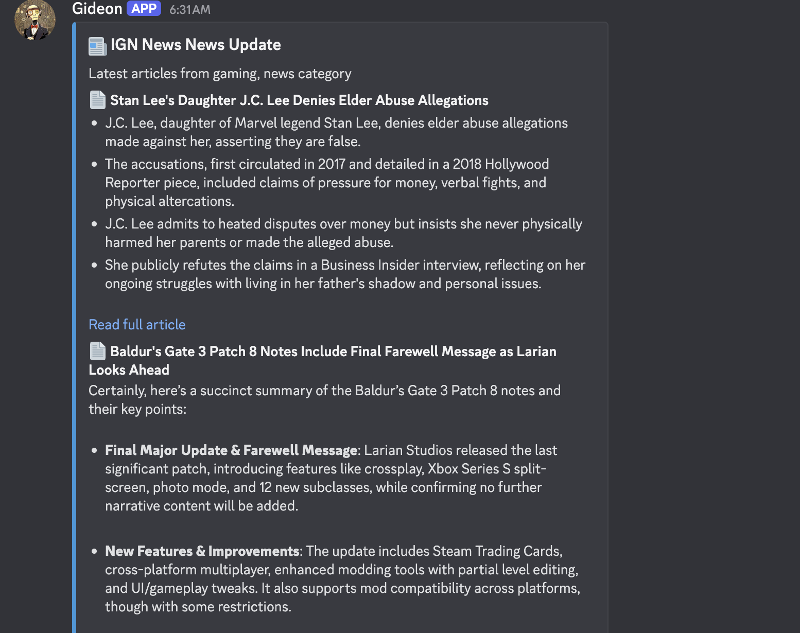

<div align="center">

# 🤖 Gideon - AI Assistant for Discord


<a href="https://www.python.org/"></a>
<a href="https://github.com/Pycord-Development/pycord"></a>
<a href="LICENSE"></a>

*Your server's intelligent companion powered by cutting-edge AI models*

[Installation](#-installation) • 
[Features](#-features) • 
[Commands](#-commands) • 
[Models](#-supported-models) • 
[Troubleshooting](#-troubleshooting)

</div>

## 🌟 Overview

Gideon transforms your Discord server into an AI-powered hub, connecting members to state-of-the-art language and image models. With Gideon, users can have intelligent conversations, generate creative images, analyze visual content, create fantasy adventures, and organize discussions through an intuitive thread system.

## ✨ Features

### 🧠 Intelligence
- **Multiple AI Models** - Access OpenAI, Anthropic Claude, Google Gemini, and more through OpenRouter


- **Conversation Memory** - Natural conversations with context across messages
- **Image Analysis** - Upload and analyze images with vision-capable AI models


- **Web Search** - Search the web for current information through conversational AI responses


- **Image Generation** - Create stunning visuals with various Stable Diffusion models


### 📰 News Feed Summaries
- **RSS Feed Monitoring** - Add and manage RSS feeds by category (tech, world, finance, etc.)



- **AI Summarization** - Automatically summarize new articles using configured AI models




- **Channel Subscriptions** - Subscribe channels to specific news categories or all feeds
- **Scheduled Updates** - Configure how often the bot checks for and posts news updates
- **Manual Fetching** - Manually trigger news updates or fetch news on demand

### 🧵 Organization
- **Conversation Threads** - Create dedicated topics with independent histories
- **Auto-Responses** - Bot automatically responds to all messages in AI threads


- **Dynamic URL Summarization** - Instantly extracts and distills key information from any shared webpage, providing concise, up-to-date summaries directly in your chat


### 🎲 Fantasy Game Master
- **Interactive Adventures** - Create and explore AI-driven tabletop RPG campaigns
- **Multiple Settings** - Choose from Fantasy, Sci-Fi, Horror, Modern, or Custom worlds
- **Dice Rolling** - Integrated dice mechanics with automatic result narration
- **Campaign State Tracking** - Track progress and character actions throughout your adventure
- **Automatic Scene Visualization** - Generate images of key moments in your adventure (requires Cloudflare Worker)

### 🛠️ Customization
- **Model Switching** - Change AI models on-the-fly with simple commands
- **Channel Personalities** - Set different system prompts per channel
- **Admin Controls** - Comprehensive configuration options for server admins

## 🚀 Installation

### Prerequisites
- Python 3.8+
- Discord bot token with Message Content Intent enabled
- OpenRouter API key
- AI Horde API key (optional but recommended for better queue priority)
- Cloudflare Worker URL (optional, for additional image generation capabilities)

### Setup

```bash
# Clone and enter repository
git clone https://github.com/Emperor-Ovaltine/gideon
cd gideon

# Set up environment and dependencies
python3 -m venv venv
source venv/bin/activate  # On Windows: venv\Scripts\activate
pip install -r requirements.txt

# Configure bot
cp .env.example .env
# Edit .env with your Discord token, OpenRouter API key, and AI Horde API key

# Launch
python3 -m src
```

### Discord Configuration

1. Create an application at [Discord Developer Portal](https://discord.com/developers/applications)
2. Under "Bot" tab:
   - Enable "Message Content Intent"
   - Copy your bot token for the `.env` file
3. Generate invite URL in "OAuth2 > URL Generator":
   - Scopes: `bot`, `applications.commands`
   - Permissions: Send Messages, Read Message History, Embed Links, Use Slash Commands

### Cloudflare Worker Configuration (Optional)

**⚠️ IMPORTANT:** Setting up and deploying the Cloudflare Worker is the responsibility of the end user. Gideon does not provide support for configuring or troubleshooting Cloudflare Workers.

If you want to use the `/dream` command for generating images:

1. Create and deploy your own Cloudflare Worker that can generate images
2. The worker should accept a JSON payload with at least a `prompt` field
3. Set the `CLOUDFLARE_WORKER_URL` in your `.env` file to your worker's URL
4. Optionally set `CLOUDFLARE_API_KEY` if your worker requires authentication

An example Cloudflare worker that has been tested with Gideon can be found here: [flux1-cloudflare-worker](https://github.com/Emperor-Ovaltine/flux1-cloudflare-worker)

**Note:** Setting up a Cloudflare Worker is also required for scene visualization in Adventure mode.

**Example /dream output**


## 🤖 Commands

### General Commands
| Command | Description |
|:-------:|:------------|
| `/chat` | Start a conversation with the AI |
| `/search` | Search the web for current information |
| `/reset` | Clear the conversation history |
| `/summarize` | Summarize the current conversation |
| `/memory` | Show conversation statistics |

### News Feed Commands
| Command | Description | Permissions |
|:-------:|:------------|:------------|
| `/addfeed` | Add a new RSS feed to monitor | Admin |
| `/removefeed` | Remove an RSS feed | Admin |
| `/listfeeds` | List all configured RSS feeds | All Users |
| `/subscribechannel` | Subscribe the current channel to news categories | Admin |
| `/unsubscribechannel` | Unsubscribe the current channel from news updates | Admin |
| `/feedupdate` | Manually trigger an update for all feeds | Admin |
| `/getnews` | Fetch and display the latest news in the current channel | All Users |
| `/setfeedfrequency` | Set how often the bot checks for news (in hours) | Admin |
| `/feedstatus` | Show the status of news feeds and subscriptions | All Users |

### Thread Commands
Gideon leverages Discord's native thread system to organize conversations and create dedicated AI chat spaces.
| Command | Description |
|:-------:|:------------|
| `/thread new` | Create a new AI conversation thread |
| `/thread message` | Send a message to a specific thread |
| `/thread list` | View all threads |
| `/thread delete` | Remove a thread |
| `/thread rename` | Change the name of a thread |
| `/thread setmodel` | Set the AI model for a thread |
| `/thread setsystem` | Set the system prompt for a thread |

### Configuration Commands
| Command | Description |
|:-------:|:------------|
| `/setmodel` | Change the global AI model |
| `/model` | View or change the current model |
| `/setsystem` | Customize the AI personality |
| `/setchannelmodel` | Set the AI model for the current channel |
| `/setchannelsystem` | Set the system prompt for the current channel |
| `/setmemory` | Set the message history limit |
| `/setwindow` | Set the time window for memory |

### Image Commands
| Command | Description |
|:-------:|:------------|
| `/imagine` | Generate images from text using AI Horde |
| `/hordemodels` | List available AI Horde models |
| `/dream` | Generate images using Cloudflare Workers |
| `/cftest` | Test the connection to Cloudflare Worker |

### Adventure Commands
| Command | Description |
|:-------:|:------------|
| `/adventure new` | Start a new tabletop RPG adventure (Fantasy, Sci-Fi, Horror, Modern, or Custom) |
| `/adventure roll` | Roll dice (e.g., 1d20, 2d6, 3d8+2) with narrated results |
| `/adventure status` | Check the status of the current adventure |
| `/adventure end` | End the current adventure with summary |
| `/adventure config_images` | Configure frequency of scene image generation |

## 📚 Supported Models

### Text Models (via OpenRouter)
- **OpenAI**: GPT-4o, GPT-4o-mini
- **Anthropic**: Claude 3.7 Sonnet
- **Google**: Gemini 2.0 Flash
- **Perplexity**: Sonar Pro
- **And more!**

### Image Models
#### Via AI Horde
- **Stable Diffusion**: SD 2.1, SDXL, and more
- **Midjourney Diffusion**
- **Realistic Vision**
- **And many community models!**

#### Via Cloudflare Worker (requires self-setup)
- **Custom model implementation** - Your Cloudflare Worker can integrate any image generation model you choose to implement

Text models can be configured in the `.env` file using the `ALLOWED_MODELS` setting.

## 📁 Project Structure

```
gideon/
├── src/                    # Source code
│   ├── bot.py              # Bot initialization
│   ├── config.py           # Configuration
│   ├── cogs/               # Command modules
│   │   ├── chat_commands.py            # Basic chat functionality
│   │   ├── thread_commands.py          # Thread management
│   │   ├── image_commands.py           # Image generation
│   │   ├── cloudflare_image_commands.py # Cloudflare image generation
│   │   ├── dungeon_master_commands.py  # Adventure functionality
│   │   ├── news_feeds_commands.py      # RSS News Feed Summaries
│   │   └── ...
│   └── utils/              # Utility functions
│       ├── openrouter_client.py  # API client for text models
│       ├── ai_horde_client.py    # API client for image generation
│       ├── cloudflare_client.py  # API client for Cloudflare image generation
│       ├── state_manager.py      # State management
│       ├── persistence.py        # State persistence
│       └── ...
├── .env.example            # Environment template
└── requirements.txt        # Dependencies
```

## 🎲 Adventure System

The Adventure System transforms Gideon into an AI Game Master for immersive tabletop roleplaying experiences:

### Features
- **AI-Powered Storytelling**: Dynamic narratives adapt to player actions
- **Multiple Settings**: Fantasy worlds, sci-fi universes, horror scenarios, and more
- **Persistent State**: Adventure progress is saved between sessions
- **Integrated Dice System**: Roll dice with standard RPG notation (1d20, 2d6+3, etc.)
- **Campaign Management**: Check status and track adventure progress
- **Scene Visualization**: Automatically generate images of key moments in your adventure

### Using the Adventure System
1. Start an adventure with `/adventure new`
2. Send messages normally in the channel to interact with your adventure
3. Roll dice when needed with `/adventure roll [dice notation]`
4. Check your progress with `/adventure status`
5. End your adventure when complete with `/adventure end`
6. Adjust image generation with `/adventure config_images [frequency]` (0 to disable)

Each adventure is channel-specific and can use your configured AI model for tailored experiences.

## ❓ Troubleshooting

- **Connection Issues**: Run `/diagnostic` to check network connectivity
- **Missing Commands**: Make sure the bot has proper permissions and try `/sync` (owner only)
- **Model Problems**: Some models require OpenRouter credits - check your account
- **State Issues**: Use `/savestate` to manually persist bot memory
- **Image Generation Issues**: If `/imagine` fails, try smaller dimensions (512×512), fewer steps, or a different model
- **Cloudflare Worker Issues**: Use `/cftest` to diagnose Cloudflare Worker connectivity problems
- **Adventure Issues**: If an adventure gets stuck, try ending it with `/adventure end` and starting a new one

<div align="center">
Made with ❤️ by <a href="https://github.com/Emperor-Ovaltine">Emperor-Ovaltine</a>
</div>

## 📖 Documentation

For detailed technical information about Gideon's architecture, implementation details, and advanced setup instructions, please refer to the [Technical Documentation](documentation.md).

The documentation provides in-depth explanations of:
- Core components and architecture
- State management system
- Command implementation details
- API integration specifics
- Adventure system mechanics
- Error handling and security considerations

## Getting Started

To get started with Gideon, follow these steps:

1. Clone the repository
2. Install the required dependencies
3. Set up your environment variables
4. Run the bot

For more detailed setup instructions, please refer to the [Technical Documentation](documentation.md).

# Configuration Variables in .env
- DISCORD_TOKEN=         # Your Discord bot token
- OPENROUTER_API_KEY=    # Your OpenRouter API key
- SYSTEM_PROMPT=         # Default AI personality
- DEFAULT_MODEL=         # Default AI model
- AI_HORDE_API_KEY=      # Optional: For better queue priority
- CLOUDFLARE_WORKER_URL= # Optional: For /dream command & adventures
- CLOUDFLARE_API_KEY=    # Optional: For worker authentication
- DATA_DIRECTORY=        # Optional: Where to store conversation data
