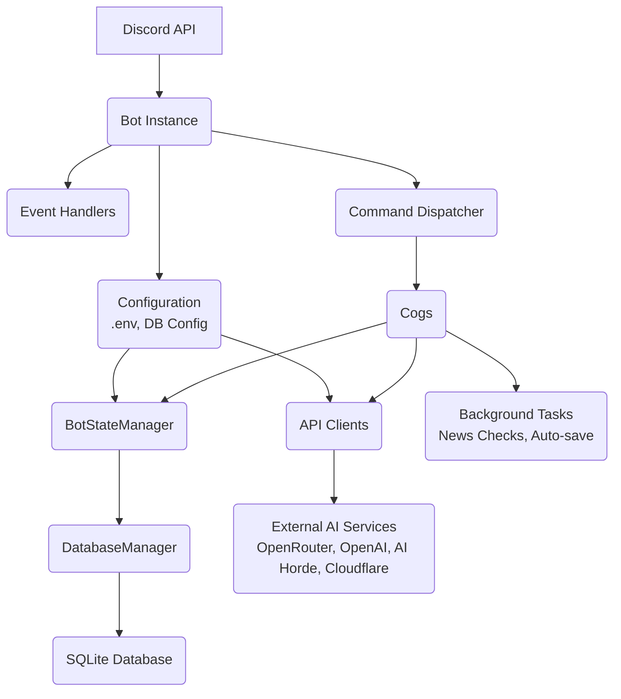

# Gideon Discord Bot - Documentation

Gideon is a feature-rich Discord bot that leverages AI capabilities to provide conversation, image generation, thread management, and tabletop RPG features. It integrates with multiple AI services and providers (like OpenRouter, OpenAI, AI Horde, Cloudflare Workers) to deliver a comprehensive AI assistant experience within Discord.

The bot follows a modular architecture using Py-Cord's cogs system, with state management via a singleton pattern that provides persistence across restarts using a SQLite database. It supports multiple AI models from various providers and maintains conversation context for natural interactions.

## Table of Contents

1.  [Overview](#overview)
2.  [Getting Started (User/Administrator Guide)](#getting-started-useradministrator-guide)
    *   [Prerequisites](#prerequisites)
    *   [Installation](#installation)
        *   [Method 1: Using Python](#method-1-using-python)
        *   [Method 2: Using Docker](#method-2-using-docker)
    *   [Configuration](#configuration)
    *   [Running the Bot](#running-the-bot)
        *   [Running with Python](#running-with-python)
        *   [Running with Docker](#running-with-docker)
    *   [Adding to Your Server](#adding-to-your-server)
3.  [Bot Usage (User/Administrator Guide)](#bot-usage-useradministrator-guide)
    *   [General Concepts](#general-concepts)
    *   [AI Chat Commands](#ai-chat-commands)
    *   [Thread Management Commands](#thread-management-commands)
    *   [Image Generation Commands](#image-generation-commands)
    *   [News Feeds Commands](#news-feeds-commands)
    *   [Adventure System Commands](#adventure-system-commands)
    *   [Configuration Commands](#configuration-commands)
    *   [Diagnostic Commands](#diagnostic-commands)
    *   [Troubleshooting Common Issues](#troubleshooting-common-issues)
4.  [Architecture and Development (Developer Guide)](#architecture-and-development-developer-guide)
    *   [High-Level Architecture](#high-level-architecture)
    *   [Project Structure](#project-structure)
    *   [Core Components](#core-components)
    *   [State Management](#state-management)
    *   [API Integrations](#api-integrations)
    *   [Command System](#command-system)
    *   [Adding New Features/Cogs](#adding-new-featurescogs)
    *   [Error Handling and Logging](#error-handling-and-logging)
    *   [Security Considerations](#security-considerations)
    *   [Configuration System](#configuration-system)
5.  [Contributing](#contributing)
6.  [License](#license)

## 1. Overview

Gideon is a versatile Discord bot designed to enhance server interactions with advanced AI capabilities. Its core functionalities include:

*   **AI Conversation:** Engage in natural language conversations with the bot, powered by various AI models from multiple providers (e.g., OpenRouter, OpenAI, AI Horde).
*   **Thread Management:** Utilize Discord's native threads for focused AI conversations with per-thread configuration overrides for models and system prompts.
*   **Image Generation:** Create images using different AI backends (AI Horde, Cloudflare Worker, OpenAI DALL-E) via a unified command interface.
*   **News Feed Summaries:** Subscribe to RSS/Atom feeds and get AI-generated summaries posted to designated channels. Supports both server-wide and personal feeds.
*   **Adventure System:** Participate in tabletop RPG-style adventures guided by the AI, featuring dice rolls and optional image generation for scenes.
*   **Flexible Configuration:** Customize bot behavior globally, per channel, or per thread for AI providers, models, and system prompts.

The bot is built on the Py-Cord library, using a modular "cog" system for organizing commands and features. State persistence (conversation history, configurations, news feeds, etc.) is handled through a SQLite database, ensuring data survives bot restarts and updates.

## 2. Getting Started (User/Administrator Guide)

This section guides users and administrators through setting up and running the Gideon bot.

### Prerequisites

Before you begin, ensure you have the following:

*   **Python 3.8 or higher:** Required for Method 1 (Python).
*   **Docker:** Required for Method 2 (Docker).
*   **A Discord Account:** You need a Discord account to create a bot application and invite it to your server.
*   **Server Permissions:** You need "Manage Server" permissions on the Discord server where you want to add the bot.
*   **API Keys:** You will need API keys for the AI services you wish to use. At a minimum, you need a Discord bot token. You will also need API keys for the specific AI providers you intend to use (e.g., OpenRouter, OpenAI).

### Installation

You can install and run Gideon using either a direct Python environment or Docker.

#### Method 1: Using Python

1.  **Clone the Repository:**
    ```bash
    git clone https://github.com/Emperor-Ovaltine/gideon
    cd gideon
    ```
2.  **Install Dependencies:**
    ```bash
    pip install -r requirements.txt
    ```

#### Method 2: Using Docker

1.  **Ensure Docker is Installed:** Download and install Docker Desktop or Docker Engine for your operating system if you haven't already.
2.  **Clone the Repository:**
    ```bash
    git clone https://github.com/Emperor-Ovaltine/gideon
    cd gideon
    ```
3.  **Build the Docker Image:**
    ```bash
    docker build -t gideon-bot .
    ```
    This command builds the Docker image based on the `Dockerfile` in the repository.

### Configuration

Gideon is configured primarily through environment variables, typically stored in a `.env` file in the root directory of the project.

1.  **Create a `.env` file:** Copy the example environment file:
    ```bash
    cp .env.example .env
    ```
2.  **Edit the `.env` file:** Open the newly created `.env` file in a text editor and fill in the required and optional variables.

    *   **Essential Variables:**
        *   `DISCORD_TOKEN`: Your Discord bot token from the Discord Developer Portal.
    *   **API Keys (At least one provider is needed for chat):**
        *   `OPENROUTER_API_KEY`: Your API key from OpenRouter.ai. Allows access to many models.
        *   `OPENAI_API_KEY`: Your API key for OpenAI. Needed for OpenAI models (chat and DALL-E image generation).
        *   `AI_HORDE_API_KEY`: Your API key for AI Horde (optional, for image generation and potentially text models).
        *   `CLOUDFLARE_WORKER_URL`: The URL of your Cloudflare Worker for image generation (optional).
        *   `CLOUDFLARE_API_KEY`: API key for your Cloudflare Worker (optional, if your worker requires authentication).
    *   **Optional Variables:**
        *   `SYSTEM_PROMPT`: Customize the bot's default personality. This prompt is sent to the AI model at the beginning of conversations.
        *   `DEFAULT_MODEL`: Set the default AI model to use (e.g., `openrouter/openai/gpt-4o-mini`). Use the format `provider/model_name`. The provider part must match the keys used internally (e.g., `openrouter`, `openai`, `ai_horde`).
        *   `DATA_DIRECTORY`: The directory where the SQLite database (`gideon_state.db`) and other data (like temporary image files) will be stored.
            *   If using **Python**: Set this to a local path, e.g., `./data`.
            *   If using **Docker**: The default `/app/data` is recommended as it aligns with the `Dockerfile` and `docker-compose.yml`. You will typically map a local directory to this path when running the container to persist data.

    **Example `.env`:**

    ```dotenv
    # Discord Bot Token
    DISCORD_TOKEN=your_discord_token_here

    # --- API Keys (Provide keys for the services you want to use) ---
    # OpenRouter API Key (Recommended for broad model access)
    OPENROUTER_API_KEY=your_openrouter_api_key_here

    # OpenAI API Key (for OpenAI models and Dall-E image generation)
    OPENAI_API_KEY=your_openai_api_key_here

    # AI Horde API Key (optional, for image/text generation)
    AI_HORDE_API_KEY=your_ai_horde_api_key_here

    # Cloudflare Worker (optional, for image generation)
    CLOUDFLARE_WORKER_URL=https://your-worker-url.workers.dev/
    CLOUDFLARE_API_KEY=your_cloudflare_api_key_here  # Optional

    # --- Optional Settings ---
    # System prompt for the AI assistant
    SYSTEM_PROMPT=You are Gideon, a helpful and friendly AI assistant.

    # Default model to use (provider/model_name format)
    DEFAULT_MODEL=openrouter/openai/gpt-4o-mini # Default uses OpenRouter

    # Data directory path. ONLY CHANGE THIS PATH IF YOU KNOW WHAT YOU ARE DOING! IT IS SET TO FUNCTION WITH DOCKER BY DEFAULT
    DATA_DIRECTORY=./data # Or /app/data if using Docker
    ```

### Running the Bot

#### Running with Python

Navigate to the bot's root directory in your terminal and run:

```bash
python src/__main__.py
```

#### Running with Docker

You can run the Docker image directly or use `docker-compose`. Using `docker-compose` is recommended as it handles mounting the data directory for persistence.

**Using docker-compose (Recommended):**

Ensure you have edited the `.env` file. From the bot's root directory, run:

```bash
docker-compose up -d
```
This will build the image (if not already built) and start the container in detached mode. The `docker-compose.yml` file is configured to mount a local `./data` directory to `/app/data` inside the container, ensuring your database and other data persist.

**Running Docker Image Directly:**

Ensure you have edited the `.env` file. From the bot's root directory, run:

```bash
docker run -d --env-file .env -v ./data:/app/data gideon-bot
```
This command runs the `gideon-bot` image in detached mode (`-d`), passes environment variables from the `.env` file (`--env-file .env`), and mounts the local `./data` directory to `/app/data` inside the container (`-v ./data:/app/data`).

The bot should connect to Discord and appear online in your server.

### Adding to Your Server

To add the bot to your Discord server, you need to generate an invite link from the Discord Developer Portal.

1.  Go to the [Discord Developer Portal](https://discord.com/developers/applications).
2.  Select your bot application.
3.  Go to "OAuth2" -> "URL Generator".
4.  Under "SCOPES", select `bot`.
5.  Under "BOT PERMISSIONS", select the necessary permissions. Recommended permissions include:
    *   `Read Messages/View Channels`
    *   `Send Messages`
    *   `Embed Links`
    *   `Attach Files`
    *   `Manage Messages` (for clearing history, etc.)
    *   `Use Slash Commands`
    *   `Manage Threads` (if using native threads)
    *   `Read Message History`
6.  Copy the generated URL and paste it into your browser. Select the server you want to add the bot to and authorize it.

## 3. Bot Usage (User/Administrator Guide)

Gideon uses Discord's slash commands (`/`) for all interactions.

### General Concepts

*   **Slash Commands:** Type `/` in the chat bar to see a list of available commands. Commands are organized into logical groups (e.g., `/dream manage`).
*   **Permissions:** Some commands are restricted to server administrators or the bot owner. If a command doesn't appear or doesn't work, you may lack the necessary permissions.
*   **Providers:** Gideon can use different backend services (providers) for AI tasks like chat (OpenRouter, OpenAI, AI Horde) and image generation (AI Horde, Cloudflare, OpenAI). Administrators can configure which provider is used globally or per channel.

### AI Chat Commands

These commands are for general conversation and interaction with the AI using the configured provider and model.

*   `/chat <prompt> [attachment]`: Engage in a conversation with the AI. Provide your text prompt. You can also attach an image when using a model that supports vision (e.g., `openai/gpt-4o`).
*   `/reset`: Clears the conversation history for the current channel or thread. This is useful if the conversation goes off track or you want to start fresh.
*   `/summarize`: Generates a summary of the recent conversation history in the current channel or thread.
*   `/memory`: Shows statistics about the conversation history being stored for the current channel or thread, including message count and time window.

### Thread Management Commands

Gideon leverages Discord's native threads for focused conversations, allowing per-thread configuration.

*   `/thread new <name>`: Creates a new public thread with the AI in the current channel. The AI will join the thread and you can chat within it.
*   `/thread message <thread> <prompt>`: Sends a message to a specific thread by mentioning the thread (e.g., `#thread-name`). Useful if you are not currently viewing that thread.
*   `/thread list`: Lists all active threads the bot is aware of in the current server, showing their names and IDs.
*   `/thread delete <thread>`: Deletes a specific thread and its associated history from the bot's database.
*   `/thread rename <thread> <new_name>`: Renames a specific thread in the bot's database.
*   `/thread setmodel <thread> [model]`: Sets a specific AI model for a thread, overriding the channel or global default. Provide the model ID in `provider/model_name` format (e.g., `openai/gpt-4o`). Omit `[model]` to reset the thread to use the channel's configured model.
*   `/thread setsystem <thread> [prompt]`: Sets a custom system prompt for a thread, overriding the channel or global default. Provide the desired prompt text. Omit `[prompt]` to reset the thread to use the channel's configured system prompt.

### Image Generation Commands

The `/dream` command provides a unified interface for generating images using different AI providers configured in the `.env` file.

*   `/dream <prompt> [negative_prompt]`: Generate an image using the currently configured AI backend.
    *   `prompt`: Describe the image you want to create. Be as descriptive as possible.
    *   `negative_prompt`: (Optional) Describe elements or styles you want to avoid in the generated image. Support for negative prompts varies by provider (e.g., OpenAI DALL-E does not support it directly).

*   **Available Providers:**
    *   **AI Horde:** A decentralized, crowdsourced image generation service. Requires `AI_HORDE_API_KEY` in `.env`. Offers various Stable Diffusion models.
    *   **Cloudflare Worker:** Allows using a custom image generation backend hosted on Cloudflare Workers. Requires `CLOUDFLARE_WORKER_URL` and optionally `CLOUDFLARE_API_KEY` in `.env`. The specific models and parameters supported depend on the worker implementation.
    *   **OpenAI:** Uses OpenAI's DALL-E models (DALL-E 2, DALL-E 3). Requires `OPENAI_API_KEY` in `.env`.

*   **Admin Management Subcommands (`/dream manage`)**: (Administrator Only)
    *   `/dream manage set_provider <provider>`: Set the active image generation provider for the bot (`ai_horde`, `cloudflare`, `openai`). The bot will use this provider for all `/dream` commands until changed.
    *   `/dream manage view_config`: View the current active provider and its default configuration settings (model, size, steps, etc.) as stored in the database.

*   **Admin Configuration Subcommands (`/dream configure`)**: (Administrator Only)
    *   `/dream configure ai_horde <model> <size> <steps>`: Configure default settings for the AI Horde provider.
        *   `model`: The default AI Horde model name (e.g., `stable_diffusion_xl`).
        *   `size`: The default image resolution (e.g., `1024x1024`). Must be a multiple of 64.
        *   `steps`: The default number of generation steps (e.g., `30`). Higher steps can increase detail but take longer.
    *   `/dream configure cloudflare <size> <steps> [seed]`: Configure default settings for the Cloudflare Worker provider.
        *   `size`: The default image resolution (e.g., `768x768`).
        *   `steps`: The default number of generation steps (e.g., `25`).
        *   `seed`: (Optional) A default random seed for reproducibility. Leave blank for a random seed each time.
    *   `/dream configure openai <model> [quality] [style]`: Configure default settings for the OpenAI (DALL-E) provider.
        *   `model`: The default OpenAI model (`dall-e-2` or `dall-e-3`).
        *   `quality`: (Optional, DALL-E 3 only) Image quality (`standard` or `hd`).
        *   `style`: (Optional, DALL-E 3 only) Image style (`vivid` or `natural`).

### News Feeds Commands

Fetch, summarize, and distribute news articles from configured RSS/Atom feeds. Summarization is performed using the currently configured AI model.

*   `/addfeed <url> [name] [category]`: (Admin) Adds a new RSS feed URL to monitor. Provide a unique URL. Optionally provide a `name` and `category` for organization.
*   `/removefeed <feed_id>`: (Admin) Removes a configured RSS feed using its unique ID (usually the URL).
*   `/listfeeds`: Lists all currently configured server-wide RSS feeds, grouped by category.
*   `/subscribechannel <channel> <category>`: (Admin) Subscribes a specific text channel to receive automatic updates from a news category. Use `all` for all categories.
*   `/unsubscribechannel <channel>`: (Admin) Unsubscribes a specific channel from all news updates.
*   `/feedupdate [force_refresh]`: (Admin) Manually triggers a check for new articles across all configured feeds and posts updates to subscribed channels. Use `force_refresh: True` to ignore the last checked time and fetch all recent articles.
*   `/getnews [category] [force_refresh]`: Fetches and displays recent news articles (up to 5 per feed by default) directly in the current channel. Optionally filter by `category`. Use `force_refresh: True` to ignore the last checked time.
*   `/setfeedfrequency <hours>`: (Admin) Sets how often (in hours) the bot automatically checks for new articles in the background (minimum 1 hour).
*   `/feedstatus`: Displays the status of configured feeds, including the URL, name, category, last checked time, and subscribed channels.
*   `/myfeeds list`: (User) Show your saved personal RSS feed URLs.
*   `/myfeeds add <url> [name]`: (User) Add an RSS feed URL to your personal list. Optionally provide a `name`.
*   `/myfeeds remove <url>`: (User) Remove an RSS feed URL from your personal list.
*   `/mynews`: (User) Get a personalized news digest from your saved personal feeds.

### Adventure System Commands

Engage in tabletop RPG adventures with the AI acting as the Dungeon Master, generating narrative based on your actions.

*   `/adventure new <setting>`: Start a new adventure in the current channel. Choose a `setting` from `Fantasy`, `Sci-Fi`, `Horror`, `Modern`, or `Custom`.
*   `/adventure action <description>`: Describe the action you want your character to take in the adventure. The AI will interpret your action and continue the narrative.
*   `/adventure roll <dice_notation>`: Roll dice using standard RPG notation (e.g., `1d20`, `2d6+3`) with AI narration. The AI will narrate the outcome based on the roll and the current adventure context.
*   `/adventure status`: Check the current state of the adventure in the channel, including the setting and turn count.
*   `/adventure end`: Conclude the current adventure in the channel.
*   `/adventure config_images <frequency>`: (Admin) Configure how often scene images are generated during the adventure (e.g., `frequency: 5` to generate an image every 5 turns). Requires the Cloudflare Worker image provider to be configured and active.

*Note: After starting an adventure, you can often interact by simply sending messages in the channel describing your actions, in addition to using the `/adventure action` command.*

### Configuration Commands

Customize bot settings globally or per channel/thread. These settings are persistent.

*   `/setprovider <provider>`: (Admin) Sets the global default AI provider for chat commands (`openrouter`, `openai`, `ai_horde`). Requires the corresponding API key in `.env`. This determines which backend service is used for `/chat` and other text generation tasks unless overridden by a channel-specific setting.
*   `/setmodel [model]`: Sets the default AI model for the current channel, overriding the global default. Provide the model ID in `provider/model_name` format (e.g., `openai/gpt-4o`). The provider part must match the currently configured provider for the channel (or the global provider if no channel override is set). Omit `[model]` to reset the channel to use the global default model.
*   `/model`: Views the current effective model and provider being used for the channel (channel override if set, otherwise global default) and shows the current global default model and provider.
*   `/setsystem [prompt]`: Sets a custom system prompt for the current channel, overriding the global default. Provide the desired prompt text. Omit `[prompt]` to reset the channel to use the global default system prompt.
*   `/setchannelmodel <channel> [model]`: (Admin) Sets the model for a specific channel by mentioning the channel (e.g., `#general`). Provide the model ID in `provider/model_name` format. Omit `[model]` to reset the channel's model override.
*   `/setchannelsystem <channel> [prompt]`: (Admin) Sets the system prompt for a specific channel by mentioning the channel. Omit `[prompt]` to reset the channel's system prompt override.
*   `/setmemory <limit>`: (Admin) Sets the maximum number of messages to remember per channel/thread for conversation history. Older messages beyond this limit are pruned.
*   `/setwindow <hours>`: (Admin) Sets the time window (in hours) for remembering messages. Messages older than this time window are pruned, regardless of the message limit.

### Troubleshooting Common Issues

*   **Bot is offline:**
    *   If using Python: Check if the Python script is still running. Check the console for errors during startup.
    *   If using Docker: Check if the Docker container is running (`docker ps`). Check the container logs (`docker logs <container_id>`).
    *   Verify the `DISCORD_TOKEN` in your `.env` file is correct.
*   **Bot not responding to commands:**
    *   Ensure the bot is online in Discord.
    *   Ensure the bot has the "Use Slash Commands" permission in the server.
    *   Discord may take a few minutes to register new slash commands after the bot starts.
    *   Check the bot's console output for errors when you try to use a command.
*   **Chat commands failing:**
    *   Verify that the required API key for the currently configured provider (check `/model`) is present and correct in the `.env` file.
    *   Check the console logs for API errors from the provider (OpenRouter, OpenAI, AI Horde).
*   **Image generation failing:**
    *   Check the bot's console output for specific API errors from AI Horde, Cloudflare, or OpenAI.
    *   Verify the API keys and URLs in your `.env` file for the selected image provider (`/dream manage view_config` shows the active provider).
    *   Ensure the bot has "Attach Files" and "Embed Links" permissions in the channel to send images.
    *   Some providers may have rate limits or require sufficient credits (e.g., AI Horde Kudos).
*   **News feeds not updating:**
    *   Check the `/feedstatus` command for the last checked time and configured frequency.
    *   Ensure the bot process is running and has internet access to fetch feeds.
    *   Check console logs for errors during feed fetching, parsing, or summarization.
    *   Verify the feed URL is valid and accessible.
*   **Commands requiring Admin/Owner permissions fail:**
    *   Ensure your Discord user has the necessary permissions in the server (Administrator role or the bot owner).
*   **Database Errors:** If you encounter errors related to the database, ensure the `DATA_DIRECTORY` is correctly configured and that the bot process has write permissions to this directory. If using Docker, ensure the volume is correctly mounted.

## 4. Architecture and Development (Developer Guide)

This section provides a deeper dive into the bot's architecture and codebase for developers and contributors.

### High-Level Architecture

The Gideon bot follows a modular design centered around Py-Cord's Cogs, with support for multiple AI providers.



*   **Discord API:** The interface for receiving events (messages, command interactions, etc.) and sending responses (messages, embeds, files).
*   **Bot Instance:** The main application object (`bot.py`) that manages the connection to Discord, registers event handlers, loads cogs, and controls the bot's lifecycle.
*   **Event Handlers:** Asynchronous functions decorated with `@bot.event` (in `bot.py`) or `@commands.Cog.listener()` (in cogs) that respond to specific Discord events (e.g., `on_ready`, `on_application_command`).
*   **Command Dispatcher:** Py-Cord's built-in mechanism that parses incoming slash command interactions and routes them to the appropriate command function within a cog based on the command name and subgroups.
*   **Cogs:** Modular classes (`src/cogs/`) that inherit from `commands.Cog`. They encapsulate related commands, listeners, and state. Examples include `ChatCommands`, `UnifiedImageCommands`, `NewsFeedsCommands`. Each cog is loaded by the bot instance during startup.
*   **BotStateManager:** A singleton utility class (`src/utils/state_manager.py`) that acts as a central point of access for the bot's dynamic runtime state. It holds configuration overrides (channel/thread specific), caches some data, and orchestrates persistence by calling methods on the `DatabaseManager`. It also contains pruning logic and manages the selection of the active AI provider and model based on configuration.
*   **DatabaseManager:** Handles direct interactions with the SQLite database file (`data/gideon_state.db`). It manages the database connection, ensures the schema is initialized and migrated, and provides low-level methods for inserting, querying, updating, and deleting data in the various tables.
*   **API Clients:** Dedicated utility classes (`src/utils/`) responsible for abstracting the communication details with external AI services. Each client (`openrouter_client.py`, `ai_horde_client.py`, `cloudflare_client.py`, `openai_client.py`) handles request formatting, sending HTTP requests (using `aiohttp`), processing responses, and basic error handling specific to that API. These clients support both chat and/or image generation depending on the service.
*   **External AI Services:** The third-party APIs that provide the core AI capabilities (language models, image generation).
*   **Background Tasks:** Asynchronous tasks implemented using `discord.ext.tasks` (e.g., `check_news_feeds` in `news_feeds_commands.py`, auto-save task in `bot.py`) that run periodically or continuously in the background without blocking the main bot loop.
*   **SQLite Database:** The file-based database (`data/gideon_state.db`) used for persistent storage of conversation history, configurations (including provider/model settings), news feed data, adventure states, and user preferences.
*   **Configuration:** Settings are loaded from environment variables (`.env`) via `config.py` on startup. Runtime configuration changes (via admin commands) are stored persistently in the `GLOBAL_CONFIG`, `CHANNEL_CONFIG`, and `THREADS` tables in the database.

*Note: The presence of `cloudflare_image_commands.py` and `image_commands.py` alongside `unified_image_commands.py` suggests some older image command implementations might still exist but the unified command is the primary interface now. Developers should focus on `unified_image_commands.py` and the client classes.*

### Project Structure

```
gideon/
├── src/                    # Source code
│   ├── bot.py              # Main bot initialization and event handling
│   ├── config.py           # Loads configuration from environment variables
│   ├── __main__.py         # Application entry point
│   ├── cogs/               # Command modules (Cogs)
│   │   ├── __init__.py             # Makes cogs directory a Python package
│   │   ├── chat_commands.py            # AI conversation commands (/chat, /reset, etc.)
│   │   ├── cloudflare_image_commands.py # (Potentially deprecated/integrated)
│   │   ├── config_commands.py          # Bot configuration commands (/setmodel, /setsystem, /setprovider etc.)
│   │   ├── diagnostic_commands.py      # Diagnostic commands (/ping)
│   │   ├── dungeon_master_commands.py  # RPG adventure system commands (/adventure)
│   │   ├── image_commands.py           # (Potentially deprecated/integrated)
│   │   ├── mention_commands.py         # Handles bot mentions
│   │   ├── news_feeds_commands.py      # RSS News Feed commands (/addfeed, /getnews, etc.)
│   │   ├── thread_commands.py          # Discord Thread management commands (/thread)
│   │   ├── unified_image_commands.py   # Unified image generation commands (/dream)
│   │   └── url_commands.py             # URL handling commands (/summarizeurl)
│   └── utils/              # Utility functions and classes
│       ├── __init__.py             # Makes utils directory a Python package
│       ├── ai_horde_client.py    # Client for AI Horde API (Image/Text)
│       ├── cloudflare_client.py  # Client for Cloudflare Worker API (Image)
│       ├── database.py           # Handles SQLite database interactions and schema
│       ├── model_manager.py      # Manages available AI models (fetches from providers)
│       ├── openai_client.py      # Client for OpenAI API (DALL-E, Chat/Vision)
│       ├── openrouter_client.py  # Client for OpenRouter API (Chat, Vision, Web Search)
│       ├── permissions.py        # Utility functions for Discord permissions
│       └── state_manager.py      # Singleton for centralized state access and management
├── .env.example            # Template for environment variables
├── requirements.txt        # Project dependencies
├── documentation.md        # This documentation file
├── documentation_plan.md   # The plan for this document
├── LICENSE                 # Project license
├── README.md               # Project README
├── _config.yml             # Jekyll config (if using GitHub Pages)
├── docker-compose.yml      # Docker Compose file for easy setup
├── Dockerfile              # Defines the Docker image
└── assets/                 # Static assets (images, etc.)
    └── images/
        └── ... (screenshots and logo)
```

### Core Components

*   **`bot.py`:** This is the heart of the bot application. It initializes the `discord.Bot` instance with necessary intents, loads all cogs found in the `src/cogs` directory, sets up signal handlers for graceful shutdown (ensuring state is saved), registers a global error handler to catch unhandled exceptions, and manages the connection to the Discord API. It also initializes the `BotStateManager` and `ModelManager` instances, making them available to cogs.
*   **`config.py`:** This module is responsible for loading configuration values from the environment, primarily from the `.env` file using the `python-dotenv` library. It provides access to critical settings like `DISCORD_TOKEN`, API keys, `SYSTEM_PROMPT`, `DEFAULT_MODEL`, and paths like `DATA_DIRECTORY`.
*   **`__main__.py`:** This is the script executed to start the bot. It typically performs minimal setup, such as loading the configuration and then calling the `run()` method on the bot instance defined in `bot.py` to start the Discord event loop.

### State Management

The bot's operational state, including conversation histories, configurations, and feature-specific data, is managed in memory by the `BotStateManager` and persistently stored in a SQLite database using the `DatabaseManager`.

*   **`BotStateManager` (`src/utils/state_manager.py`):** Implemented as a singleton, this class provides a unified, high-level interface for accessing and modifying the bot's state. It holds runtime configuration settings (like maximum history length, time window for pruning, global model, global provider) and delegates the actual reading and writing of data to the `DatabaseManager`. It includes logic for managing conversation history per channel/thread, handling thread-specific overrides, determining the effective provider and model for a given context, and orchestrating the pruning of old data. It also interacts with the `ModelManager` for model validation.
*   **`DatabaseManager` (`src/utils/database.py`):** This class is responsible for all direct interactions with the SQLite database file (`data/gideon_state.db`). It manages the database connection, ensures the schema is initialized and migrated, and provides low-level methods for inserting, querying, updating, and deleting data in the various tables.
    *   `GLOBAL_CONFIG`: Stores key-value pairs for global bot settings that can be changed at runtime (e.g., `max_channel_history`, `time_window_hours`, `global_model`, `global_provider`, `news_update_frequency`). Values are stored as TEXT along with a type indicator (`string`, `int`, `float`, `bool`, `json`).
    *   `CHANNELS`: Stores a list of channel IDs the bot has interacted with, primarily to support foreign key constraints and channel-specific configurations.
    *   `CHANNEL_CONFIG`: Stores channel-specific overrides for `model`, `provider`, and `system_prompt`. Linked to `CHANNELS` via a foreign key.
    *   `THREADS`: Stores information about Discord threads (ID, parent channel ID, name, creation timestamp) and also includes columns for thread-specific `model` and `system_prompt` overrides. Linked to `CHANNELS` via a foreign key.
    *   `MESSAGES`: Stores individual chat messages (`role`, `content`, `timestamp`, `user_id`). Each message is linked to either a `channel_id` or a `thread_id` via foreign keys. Indexes are used to optimize querying history by channel or thread and by timestamp.
    *   `NEWS_FEEDS`: Stores details about configured RSS feeds (`feed_id` - typically the URL, `url`, `name`, `category`, `last_checked` timestamp).
    *   `NEWS_CHANNEL_SUBSCRIPTIONS`: A linking table (`channel_id`, `feed_id`) to manage which channels are subscribed to which news feeds. Uses foreign keys to `CHANNELS` and `NEWS_FEEDS`.
    *   `NEWS_ARTICLES_HISTORY`: Records the `article_identifier` and `feed_id` of articles that have been processed to prevent duplicate posts. Includes a `processed_at` timestamp for pruning.
    *   `article_summaries`: Caches AI-generated summaries of news articles. Stores `article_id`, `feed_id`, `article_title`, `article_link`, `article_published_date`, `summary_text`, denormalized `feed_name` and `feed_category`, and `timestamp_summarized`.
    *   `user_article_summaries`: Stores AI-generated summaries for articles saved by individual users in their personal feeds. Includes `user_id`, `article_link`, `feed_url`, `article_title`, `article_published_date`, `summary_text`, and `timestamp_summarized`.
    *   `USERS`: Stores basic user information (`user_id`) and a `preferences_json` column to hold user-specific settings (like personal RSS feed URLs).

*   **Persistence Logic:** The `BotStateManager`'s state is loaded from the database when the bot connects to Discord (`on_ready` event in `bot.py`). Changes to configuration and the addition of new messages, threads, etc., are written to the database via `DatabaseManager` methods. An auto-save background task in `bot.py` periodically triggers the saving of the current state to the database. State is also saved during graceful shutdown.
*   **Pruning Logic:** The `BotStateManager` includes a `prune_old_data` method (called periodically by the auto-save task) that instructs the `DatabaseManager` to delete old records from the `MESSAGES`, `THREADS`, `NEWS_ARTICLES_HISTORY`, `article_summaries`, and `user_article_summaries` tables based on configured time windows (`time_window_hours`, `summary_retention_days`) and limits (`max_channel_history`). This prevents the database file from growing indefinitely.

### API Integrations

The bot interacts with external AI services through dedicated client classes in the `src/utils/` directory, typically using the `aiohttp` library for asynchronous HTTP requests. A key aspect is the support for multiple providers for both chat and image generation.

*   **`OpenRouterClient` (`openrouter_client.py`):** Handles communication with the OpenRouter API. Primarily used for chat completions, accessing a wide variety of models. Supports vision and web search.
*   **`AIHordeClient` (`ai_horde_client.py`):** Interacts with the AI Horde API. Used for image generation and can also be used for text generation if configured as the provider.
*   **`CloudflareWorkerClient` (`cloudflare_client.py`):** Communicates with a custom image generation API hosted on Cloudflare Workers.
*   **`OpenAIClient` (`openai_client.py`):** Interacts directly with the OpenAI API. Used for DALL-E image generation and can also be used directly for chat completions (including vision models).

The `ChatCommands` cog determines the effective provider and model for the current context (channel/thread/global) via `BotStateManager` and then uses the corresponding client's `send_message_with_history` method. Similarly, `UnifiedImageCommands` selects the appropriate image generation client based on its separate configuration.

### Command System

Gideon utilizes Py-Cord's modern application command (slash command) framework for all user interactions.

*   **Command Definition:** Commands are defined as asynchronous methods within cog classes. They are decorated with `@discord.slash_command` to specify the command name and description. Parameters are defined using the `@option` decorator, allowing for type hinting, descriptions, required status, and choices.
*   **Cog Structure:** Each major feature or group of related commands resides in its own class that inherits from `commands.Cog`. This promotes modularity and organization. The bot discovers and loads these cogs during startup by iterating through the files in the `src/cogs/` directory. Each cog file must have a `setup` function that the bot calls to add the cog instance (`bot.add_cog(MyCog(bot))`).
*   **Command Groups and Subgroups:** Commands can be nested into hierarchical structures using `discord.SlashCommandGroup` and the `create_subgroup()` method. This helps organize commands logically (e.g., `/dream manage set_provider`).
*   **Permissions:** Access control for commands is implemented using Py-Cord's built-in checks, applied as decorators to command methods. Common checks include `@commands.is_owner()` (restricts command to the bot's owner) and `@commands.has_permissions(administrator=True)` (restricts command to users with administrator permissions in the server).

### Adding New Features/Cogs

To contribute a new feature or set of commands to Gideon:

1.  **Create a new Python file** in the `src/cogs/` directory (e.g., `my_new_feature_cog.py`).
2.  **Define a class** within this file that inherits from `commands.Cog`.
3.  **Add commands** as asynchronous methods within your new cog class. Use `@discord.slash_command` and `@option` decorators to define the command interface.
4.  **Implement the logic** for your commands within these methods. You can access the bot instance via `self.bot` and interact with the `BotStateManager` (`self.bot.state_manager`) or other utilities as needed.
5.  **Include a `setup` function** at the end of your new cog file. This function is required by Py-Cord for the bot to load your cog:
    ```python
    def setup(bot):
        bot.add_cog(MyNewFeatureCog(bot))
    ```
6.  Ensure your new cog file is placed in the `src/cogs/` directory so the bot can discover and load it on startup.

### Error Handling and Logging

*   **Error Handling Strategy:** The bot implements a multi-layered approach to error handling. Specific exceptions are caught and handled within `try...except` blocks in individual command functions. Cog-level error handlers (methods decorated with `@commands.Cog.listener("on_application_command_error")`) can catch errors from commands within that cog. A global error handler is registered in `bot.py` (`@bot.event`) to catch any exceptions not handled at lower levels. This layered approach ensures that errors are caught, logged, and user-friendly error messages are provided where possible, preventing the bot from crashing due to unhandled exceptions.
*   **Logging System:** The standard Python `logging` module is used throughout the codebase. Loggers are configured in `bot.py` to output messages to the console with different severity levels (DEBUG, INFO, WARNING, ERROR, CRITICAL). Logs are typically output to the console and can be configured for file output. Detailed tracebacks are logged for errors to aid in debugging. Developers should use the appropriate logger (`logging.getLogger(__name__)` in each module) and logging levels (`logger.info`, `logger.error`, `logger.debug`, `logger.exception`) to provide useful information about the bot's operation and any issues encountered.

### Security Considerations

*   **API Key Management:** All sensitive API keys (Discord, OpenRouter, AI Horde, Cloudflare, OpenAI) are stored exclusively in environment variables, typically within the `.env` file. They are loaded into the application via `config.py` and accessed at runtime. This prevents hardcoding credentials directly in the source code, which is a critical security practice.
*   **Permission Controls:** Access to sensitive or administrative commands is strictly controlled using Discord's built-in permission system and enforced by Py-Cord decorators (`@commands.is_owner()`, `@commands.has_permissions()`). This ensures that only authorized users can perform actions like changing bot configuration or managing feeds.
*   **Input Validation:** Command inputs and data received from external APIs are validated where necessary to prevent unexpected behavior, injection vulnerabilities, or crashes due to malformed data.
*   **Data Protection:** The primary persistent data is stored in the SQLite database file (`data/gideon_state.db`). While the bot itself does not implement database-level encryption, it is highly recommended that the host system where the bot is running utilizes filesystem-level encryption to protect this data at rest, especially if sensitive conversation history is being stored. Automatic pruning helps limit the amount of historical data stored, reducing the potential impact of a data breach.

### Configuration System

Configuration in Gideon is managed through a combination of static environment variables and dynamic, persistent settings stored in the database.

*   **Environment Variables:** Loaded on bot startup from the `.env` file via `config.py`. These are typically used for settings that define the bot's connection to external services (API keys, URLs) and initial default behaviors (`SYSTEM_PROMPT`, `DEFAULT_MODEL`, `DATA_DIRECTORY`). These values are loaded once at startup.
*   **Database Configuration (`GLOBAL_CONFIG` table):** Stores global settings that can be modified at runtime via administrator commands (e.g., `/setprovider`, `/setmemory`, `/setwindow`, `/setfeedfrequency`, `/dream manage set_provider`, `/dream configure`). These settings are loaded into the `BotStateManager` on startup and saved back to the database when changed, ensuring they persist across bot restarts. The `global_provider` and `global_model` keys determine the default AI service for chat.
*   **Channel/Thread Overrides (`CHANNEL_CONFIG`, `THREADS` tables):** Allow administrators to override the global default provider, model, and system prompt for specific channels or threads using commands like `/setchannelmodel`, `/setchannelsystem`, `/thread setmodel`, `/thread setsystem`. These overrides are stored in the database and loaded by the `BotStateManager` to determine the effective configuration for a given conversation context.

## 5. Contributing

Contributions to the Gideon Discord Bot are welcome! If you'd like to contribute, please follow these steps:

1.  Fork the repository on GitHub: `https://github.com/Emperor-Ovaltine/gideon`
2.  Clone your forked repository to your local machine.
3.  Create a new branch for your feature or bug fix.
4.  Make your changes, following the project's coding style and guidelines.
5.  Write clear and concise commit messages.
6.  Test your changes thoroughly.
7.  Push your changes to your fork on GitHub.
8.  Open a Pull Request from your branch to the `main` branch of the original repository.
9.  Provide a clear description of your changes and why they are necessary.

Please also feel free to open issues on the GitHub repository to report bugs, suggest new features, or discuss potential improvements.

## 6. License

This project is licensed under the [MIT License](LICENSE). See the `LICENSE` file in the repository for the full text.
