<p align="center">
  
</p>

<p align="center">
  <a href="https://www.python.org/"></a>
  <a href="https://github.com/Pycord-Development/pycord"></a>
  <a href="LICENSE"></a>
</p>

<p align="center"><em>Your server's intelligent companion powered by cutting-edge AI models</em></p>

<p align="center">
  <a href="#-installation">Installation</a> •
  <a href="#-features">Features</a> •
  <a href="#-commands">Commands</a> •
  <a href="#-supported-models">Models</a> •
  <a href="#-troubleshooting">Troubleshooting</a> •
  <a href="documentation.md">Documentation</a>
</p>

# 🤖 Gideon - AI Assistant for Discord

## 🌟 Overview

Gideon transforms your Discord server into an AI-powered hub, connecting members to state-of-the-art language and image models. With Gideon, users can have intelligent conversations, generate creative images, analyze visual content, summarize news feeds, manage URLs, create fantasy adventures, and organize discussions through an intuitive thread system.

## ✨ Features

### 🧠 Intelligence
- **Multiple AI Models** - Access OpenAI, Anthropic Claude, Google Gemini, and more through OpenRouter

<p align="center">
  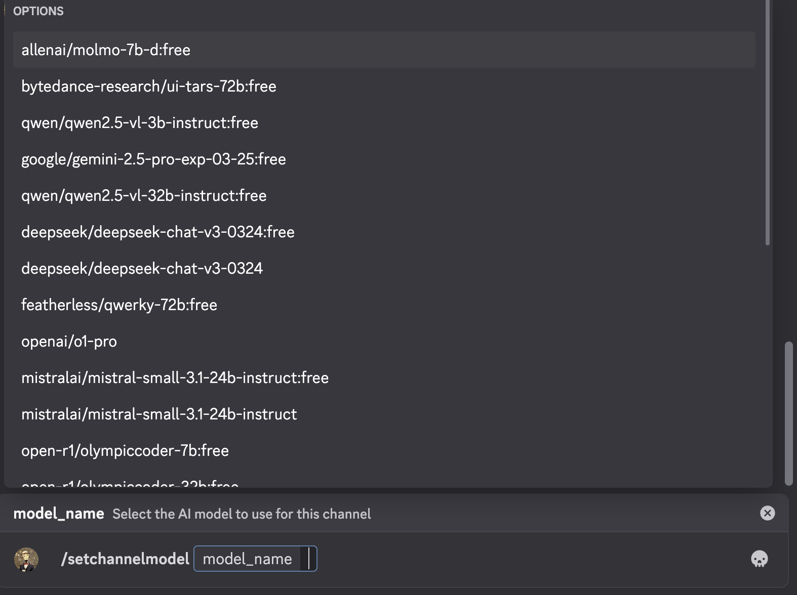
</p>

- **Conversation Memory** - Natural conversations with context across messages

- **Web Search** - Search the web for current information through conversational AI responses

<p align="center">
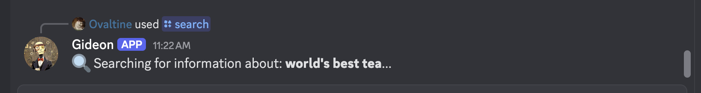
</p>
<p align="center">
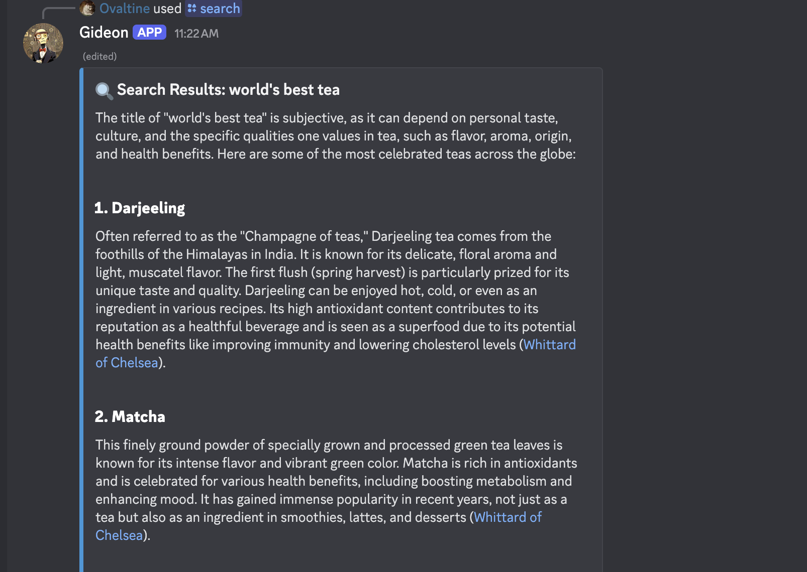
</p>
<p align="center">
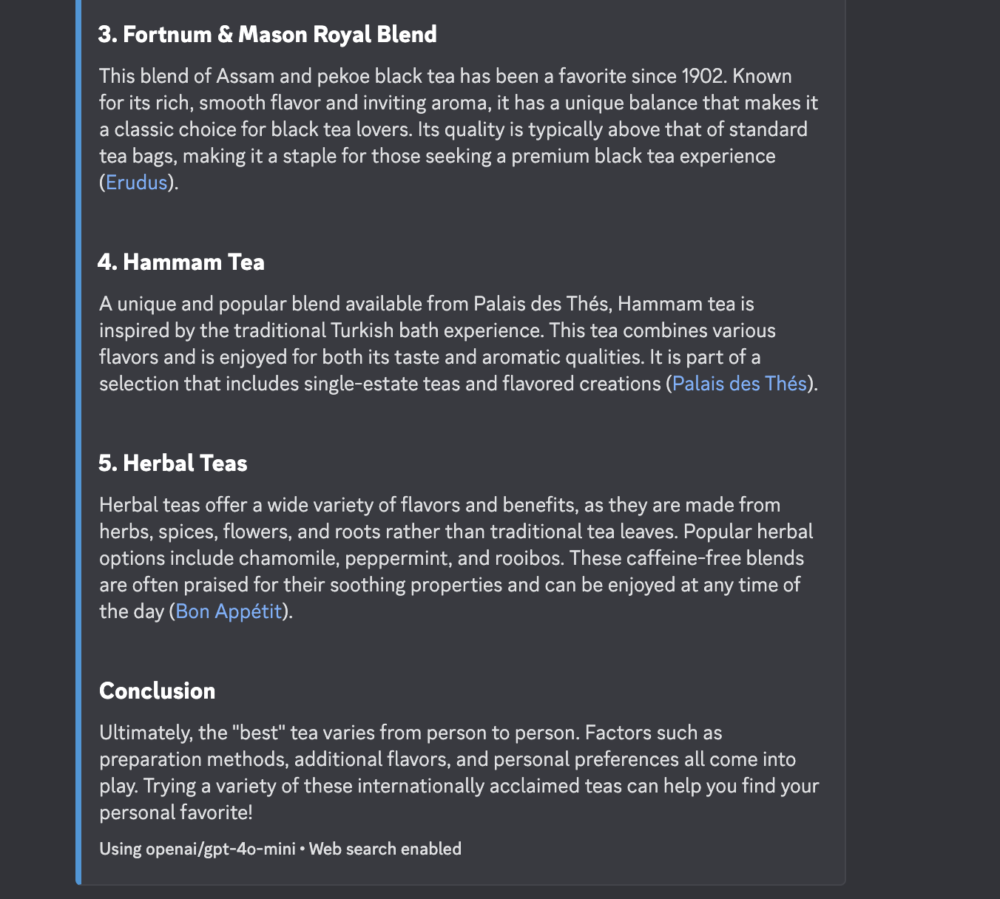
</p>

- **Image Analysis** - Upload and analyze images with vision-capable AI models

<p align="center">
  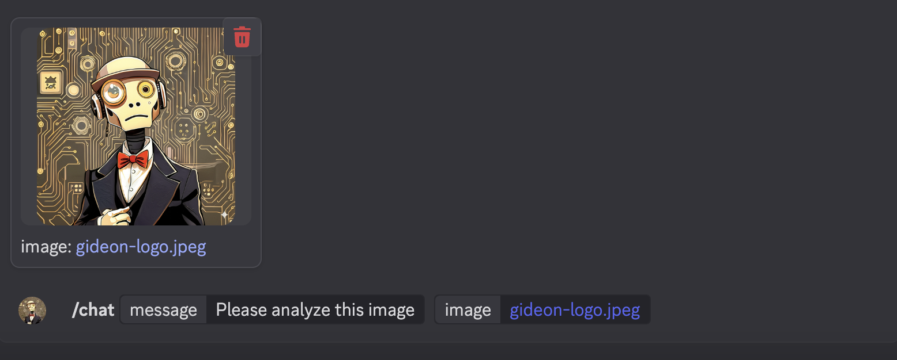
</p>

<p align="center">
  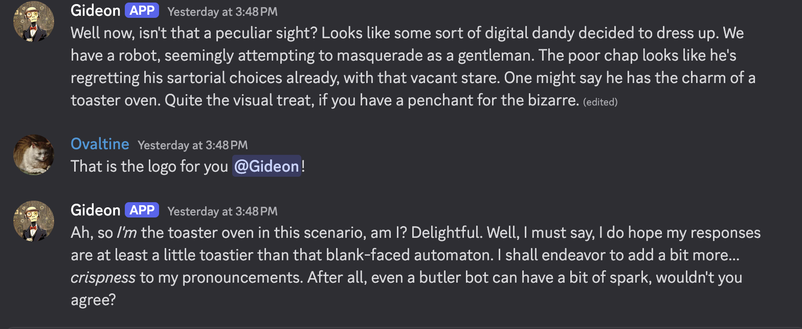
</p>

- **Image Generation** - Create stunning visuals with various Stable Diffusion models via AI Horde or a custom Cloudflare Worker

<p align="center">
  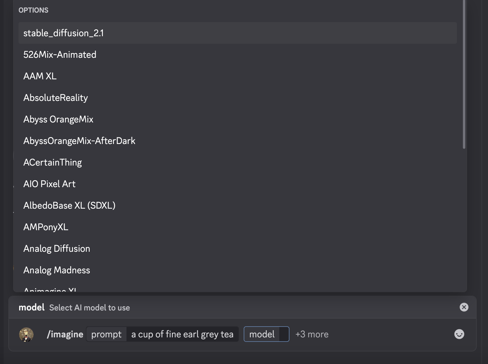
</p>

<p align="center">
  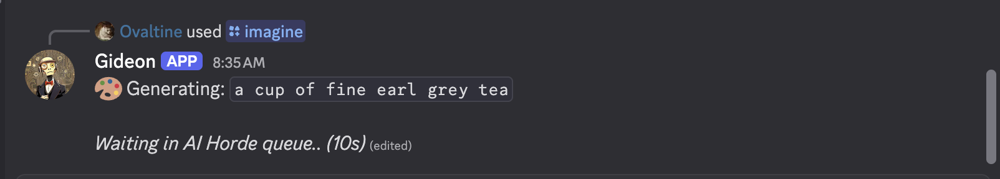
</p>

<p align="center">
  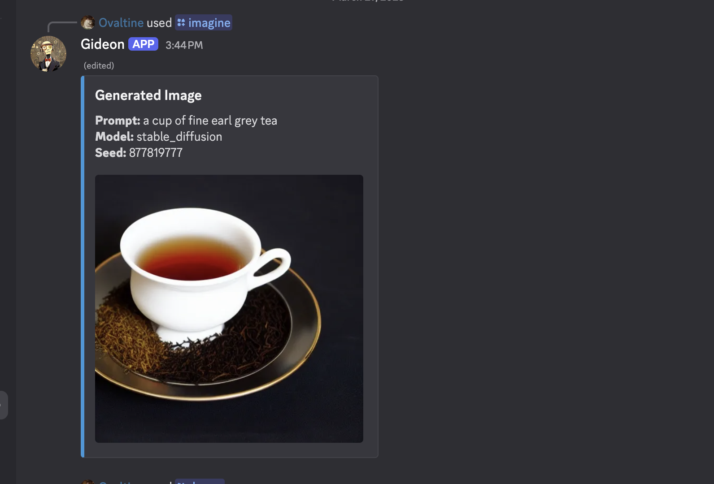
</p>

### 🧵 Organization
- **Conversation Threads** - Create dedicated topics with independent histories using Discord's native threads
- **Auto-Responses** - Bot automatically responds to all messages in AI threads

<p align="center">
  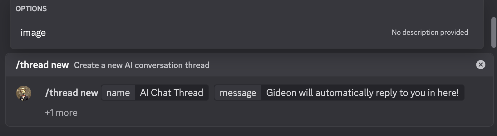
</p>

<p align="center">
  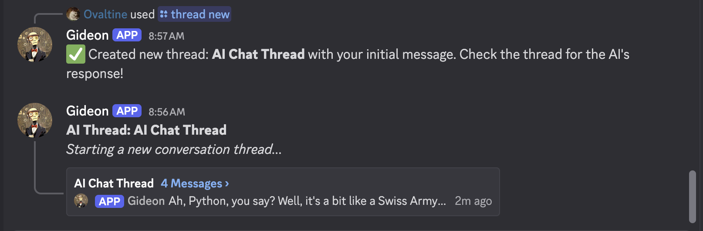
</p>

<p align="center">
  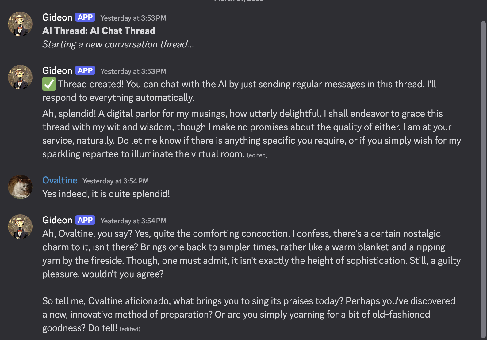
</p>

- **Dynamic URL Summarization** - Instantly extracts and distills key information from any shared webpage, providing concise, up-to-date summaries directly in your chat.

<p align="center">
  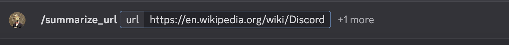
</p>

<p align="center">
  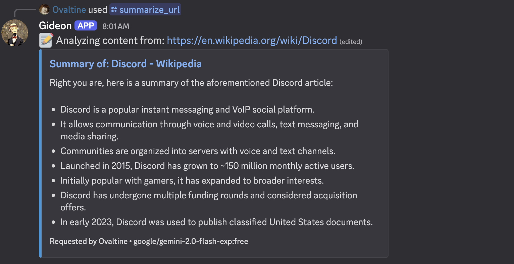
</p>


### 🛠️ Customization
- **Model Switching** - Change AI models on-the-fly with simple commands
- **Channel Personalities** - Set different system prompts per channel
- **Admin Controls** - Comprehensive configuration options for server admins

## 🚀 Installation

There are two ways to install and run Gideon: using Docker (recommended for ease of deployment and management) or directly with Python.

### Prerequisites

**For both methods:**
- Git installed
- Discord bot token with Message Content Intent enabled ([Discord Developer Portal](https://discord.com/developers/applications))
- OpenRouter API key ([OpenRouter.ai](https://openrouter.ai/))
- AI Horde API key (optional, for `/imagine` command - [AI Horde](https://aihorde.net/register))
- Cloudflare Worker URL & API Key (optional, for `/dream` command and Adventure scene visualization - requires self-setup, see [Cloudflare Worker Configuration](#cloudflare-worker-configuration-optional))

**For Docker Installation:**
- Docker installed
- Docker Compose installed (usually included with Docker Desktop)

**For Python Installation:**
- Python 3.8+

### Docker Installation (Recommended)

1.  **Clone the Repository:**
    ```bash
    git clone https://github.com/Emperor-Ovaltine/gideon
    cd gideon
    ```

2.  **Configure Environment:**
    *   Copy the example environment file:
        ```bash
        cp .env.example .env
        ```
    *   **Edit the `.env` file** with your actual API keys and tokens (`DISCORD_TOKEN`, `OPENROUTER_API_KEY`, etc.). Leave `DATA_DIRECTORY` blank or commented out when using Docker Compose with the provided configuration, as the volume mount handles data persistence.

3.  **Build the Docker Image:**
    *   Build the image using the included Dockerfile. This command builds the image and tags it as `gideon-bot:latest`.
        ```bash
        docker build -t gideon-bot:latest .
        ```
    *   *(Optional)* If you plan to distribute the image or use a registry like Docker Hub or GHCR, you would tag and push the image here.

4.  **Configure Docker Compose:**
    *   Open the `docker-compose.yml` file.
    *   **Verify the `volumes` section.** The default `docker-compose.yml` is set up to use a bind mount. It maps a directory from your host machine to the `/app/data` directory inside the container.
        ```yaml
        # Example docker-compose.yml volume section:
        volumes:
          # This maps a host directory to the container's data directory
          - ./gideon_data:/app/data # Example: Creates 'gideon_data' in the current directory
        ```
    *   **Important:** Ensure the host path part (`./gideon_data` in the example) points to a location where Docker has permission to create/write files. Using a relative path like `./gideon_data` will create the directory within your `gideon` project folder.
    *   *(Optional)* If you pushed your image to a registry in step 3, update the `image:` line to point to your registry image (e.g., `image: your-dockerhub-username/gideon:latest` or `image: ghcr.io/your-github-username/gideon:latest`). Otherwise, leave it as `image: gideon-bot:latest` to use the locally built image.

5.  **Run the Container:**
    *   Start the bot using Docker Compose in detached mode (runs in the background):
        ```bash
        docker-compose up -d
        ```
    *   To view logs: `docker-compose logs -f`
    *   To stop the bot: `docker-compose down`

### Python Installation

```bash
# Clone and enter repository (if not already done)
# git clone https://github.com/Emperor-Ovaltine/gideon
# cd gideon

# Set up environment and dependencies
python3 -m venv venv
source venv/bin/activate  # On Windows: venv\Scripts\activate
pip install -r requirements.txt

# Configure bot
cp .env.example .env
# Edit .env with your Discord token, OpenRouter API key, AI Horde API key,
# AND set the DATA_DIRECTORY to an absolute path where the bot can write data.
# Example: DATA_DIRECTORY=/home/user/gideon_data
# If DATA_DIRECTORY is not set, data (including the SQLite database file, typically 'gideon.db')
# will be stored in a 'data' subdirectory within the project.

# Launch
python3 -m src
```

### Discord Configuration

1. Create an application at [Discord Developer Portal](https://discord.com/developers/applications)
2. Under "Bot" tab:
   - Enable "Message Content Intent"
   - Copy your bot token for the `.env` file
3. Generate invite URL in "OAuth2 > URL Generator":
   - Scopes: `bot`, `applications.commands`
   - Permissions: Send Messages, Read Message History, Embed Links, Use Slash Commands, Manage Threads (for `/thread` commands)

### Cloudflare Worker Configuration (Optional)

**⚠️ IMPORTANT:** Setting up and deploying the Cloudflare Worker is the responsibility of the end user. Gideon does not provide support for configuring or troubleshooting Cloudflare Workers.

If you want to use the `/dream` command for generating images or enable scene visualization in Adventure mode:

1. Create and deploy your own Cloudflare Worker that can generate images (e.g., using Cloudflare's AI platform or another service).
2. The worker should accept a JSON payload with at least a `prompt` field and return image data.
3. Set the `CLOUDFLARE_WORKER_URL` in your `.env` file to your worker's URL.
4. Optionally set `CLOUDFLARE_API_KEY` if your worker requires authentication (e.g., via a header like `Authorization: Bearer YOUR_KEY`).

An example Cloudflare worker that has been tested with Gideon can be found here: [flux1-cloudflare-worker](https://github.com/Emperor-Ovaltine/flux1-cloudflare-worker)

**Example /dream output**

<p align="center">
  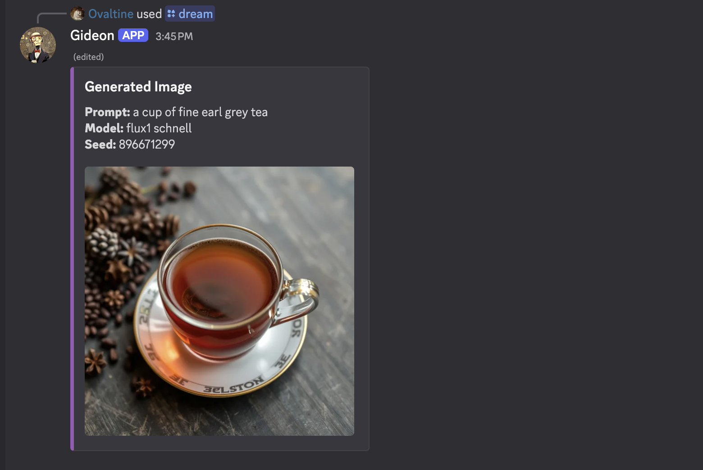
</p>


## 🤖 Commands

### General Commands
<table>
  <thead>
    <tr>
      <th>Command</th>
      <th>Description</th>
    </tr>
  </thead>
  <tbody>
    <tr>
      <td><code>/chat</code></td>
      <td>Start a conversation with the AI (supports image uploads for vision models)</td>
    </tr>
    <tr>
      <td><code>/search</code></td>
      <td>Search the web for current information using the AI</td>
    </tr>
    <tr>
      <td><code>/reset</code></td>
      <td>Clear the conversation history for the current channel</td>
    </tr>
    <tr>
      <td><code>/summarize</code></td>
      <td>Summarize the current conversation history</td>
    </tr>
    <tr>
      <td><code>/memory</code></td>
      <td>Show conversation statistics (message count, history window)</td>
    </tr>
  </tbody>
</table>

### Thread Commands
Gideon leverages Discord's native thread system to organize conversations and create dedicated AI chat spaces.
<table>
  <thead>
    <tr>
      <th>Command</th>
      <th>Description</th>
    </tr>
  </thead>
  <tbody>
    <tr>
      <td><code>/thread new</code></td>
      <td>Create a new AI conversation thread</td>
    </tr>
    <tr>
      <td><code>/thread message</code></td>
      <td>Send a message to a specific thread</td>
    </tr>
    <tr>
      <td><code>/thread list</code></td>
      <td>View all active AI threads in the channel</td>
    </tr>
    <tr>
      <td><code>/thread delete</code></td>
      <td>Remove an AI thread and its history</td>
    </tr>
    <tr>
      <td><code>/thread rename</code></td>
      <td>Change the name of an AI thread</td>
    </tr>
    <tr>
      <td><code>/thread show</code></td>
      <td>View thread configuration settings</td>
    </tr>
    <tr>
      <td><code>/thread model</code></td>
      <td>Set the AI model for this thread</td>
    </tr>
    <tr>
      <td><code>/thread system</code></td>
      <td>Set the system prompt for this thread</td>
    </tr>
  </tbody>
</table>

### Settings Commands (Admin)
Manage global bot configuration settings.

<table>
  <thead>
    <tr>
      <th>Command</th>
      <th>Description</th>
    </tr>
  </thead>
  <tbody>
    <tr>
      <td><code>/settings show</code></td>
      <td>View all current global settings</td>
    </tr>
    <tr>
      <td><code>/settings model</code></td>
      <td>Set global AI model (format: provider/model)</td>
    </tr>
    <tr>
      <td><code>/settings system</code></td>
      <td>Set global system prompt</td>
    </tr>
    <tr>
      <td><code>/settings provider</code></td>
      <td>Set global AI provider (openrouter/openai)</td>
    </tr>
    <tr>
      <td><code>/settings memory</code></td>
      <td>Set message history limit</td>
    </tr>
    <tr>
      <td><code>/settings window</code></td>
      <td>Set time window for history (hours)</td>
    </tr>
    <tr>
      <td><code>/settings restore</code></td>
      <td>Reset all settings to defaults</td>
    </tr>
  </tbody>
</table>

### Channel Commands (Admin)
Configure channel-specific overrides for AI behavior.

<table>
  <thead>
    <tr>
      <th>Command</th>
      <th>Description</th>
    </tr>
  </thead>
  <tbody>
    <tr>
      <td><code>/channel show</code></td>
      <td>View current channel settings</td>
    </tr>
    <tr>
      <td><code>/channel model</code></td>
      <td>Set AI model for this channel</td>
    </tr>
    <tr>
      <td><code>/channel system</code></td>
      <td>Set system prompt for this channel</td>
    </tr>
    <tr>
      <td><code>/channel provider</code></td>
      <td>Set AI provider for this channel</td>
    </tr>
    <tr>
      <td><code>/channel reset</code></td>
      <td>Clear all channel overrides</td>
    </tr>
    <tr>
      <td><code>/channel list</code></td>
      <td>List all channels with custom settings</td>
    </tr>
  </tbody>
</table>

### Admin Commands
Administrative tools and diagnostics (Admin/Owner only).

<table>
  <thead>
    <tr>
      <th>Command</th>
      <th>Description</th>
    </tr>
  </thead>
  <tbody>
    <tr>
      <td><code>/admin sync</code></td>
      <td>Sync slash commands with Discord (Owner only)</td>
    </tr>
    <tr>
      <td><code>/admin debug</code></td>
      <td>Show debug information</td>
    </tr>
    <tr>
      <td><code>/admin state</code></td>
      <td>Display database state information</td>
    </tr>
    <tr>
      <td><code>/admin diagnostic</code></td>
      <td>Run system diagnostics</td>
    </tr>
    <tr>
      <td><code>/admin vision_models</code></td>
      <td>List all vision-capable AI models</td>
    </tr>
  </tbody>
</table>

### Configuration Commands (Deprecated)
These commands are deprecated and will be removed in a future update. Please use the new grouped commands above.
<table>
  <thead>
    <tr>
      <th>Command</th>
      <th>Description</th>
      <th>Permissions</th>
    </tr>
  </thead>
  <tbody>
    <tr>
      <td><code>/setmodel</code></td>
      <td>Change the default AI model for the server</td>
      <td>Admin</td>
    </tr>
    <tr>
      <td><code>/model</code></td>
      <td>View or change the current model for the channel/thread</td>
      <td>All Users</td>
    </tr>
    <tr>
      <td><code>/setsystem</code></td>
      <td>Customize the default AI personality (system prompt)</td>
      <td>Admin</td>
    </tr>
    <tr>
      <td><code>/setchannelmodel</code></td>
      <td>Set the AI model for the current channel</td>
      <td>Admin</td>
    </tr>
    <tr>
      <td><code>/setchannelsystem</code></td>
      <td>Set the system prompt for the current channel</td>
      <td>Admin</td>
    </tr>
    <tr>
      <td><code>/setmemory</code></td>
      <td>Set the message history limit (max messages)</td>
      <td>Admin</td>
    </tr>
    <tr>
      <td><code>/setwindow</code></td>
      <td>Set the time window for memory (in hours)</td>
      <td>Admin</td>
    </tr>
  </tbody>
</table>

### Image Commands
Gideon now uses a unified command for image generation with support for multiple backend providers.

<table>
  <thead>
    <tr>
      <th>Command</th>
      <th>Description</th>
      <th>Permissions</th>
    </tr>
  </thead>
  <tbody>
    <tr>
      <td><code>/dream prompt:... [negative_prompt:...]</code></td>
      <td>Generate an image using the currently configured AI backend.</td>
      <td>All Users</td>
    </tr>
    <tr>
      <td><code>/dream manage set_provider provider:<Choice></code></td>
      <td>Set the active image generation provider (AI Horde, Cloudflare, OpenAI).</td>
      <td>Admin</td>
    </tr>
    <tr>
      <td><code>/dream manage configure <provider> [options...]</code></td>
      <td>Configure default settings for a specific provider (e.g., model, size, steps).</td>
      <td>Admin</td>
    </tr>
    <tr>
      <td><code>/dream manage view_config</code></td>
      <td>View the current active provider and configuration for all providers.</td>
      <td>Admin</td>
    </tr>
  </tbody>
</table>

## 📚 Supported Models

### Text Models (via OpenRouter)
- **OpenAI**: GPT-4o, GPT-4o-mini, GPT-4 Turbo, etc.
- **Anthropic**: Claude 3.7 Sonnet, Claude 3 Opus, Claude 3 Haiku, etc.
- **Google**: Gemini 2.0 Flash, Gemini Pro 1.5, etc.
- **Meta**: Llama 3 70B, 8B, etc.
- **Mistral**: Mistral Large, Mixtral 8x22B, etc.
- **Perplexity**: Sonar Large, Sonar Small
- **And many more!** Check [OpenRouter.ai](https://openrouter.ai/models) for the full list.

### Image Models
#### Via AI Horde
- **Stable Diffusion**: SD 2.1, SDXL, and various fine-tuned community models.
- Check `/hordemodels` for currently available options.

#### Via Cloudflare Worker (requires self-setup)
- **Custom model implementation** - Your Cloudflare Worker can integrate any image generation model you choose (e.g., Stable Diffusion via Cloudflare's platform).

## ❓ Troubleshooting

- **Connection Issues**: Run `/admin diagnostic` to check network connectivity to Discord and APIs.
- **Missing Commands**: Ensure the bot has `applications.commands` scope and necessary permissions (Send Messages, Read History, Embed Links, Manage Threads). Try re-inviting if needed. Use `/admin sync` (owner only) as a last resort.
- **Model Problems**: Some models require OpenRouter credits - check your account balance. Ensure the model ID used is correct. Use `/settings show` to view current model configuration.
- **State Issues**: Check logs for errors related to database operations. Ensure the `DATA_DIRECTORY` (Python) or Docker volume mount is writable and contains the `gideon_state.db` file. The bot automatically saves state to the database periodically and on shutdown.
- **Image Generation Issues**: If `/dream` fails, try simpler prompts, different models, or smaller dimensions. Check provider configuration with `/dream manage view_config`. Verify API keys in `.env`.
- **Cloudflare Worker Issues**: Verify your `CLOUDFLARE_WORKER_URL` and `CLOUDFLARE_API_KEY` in `.env` are correct and your worker is deployed and running.

## 📖 Documentation

For detailed technical information about Gideon's architecture, implementation details, and advanced setup instructions, please refer to the [Technical Documentation](documentation.md).

<p align="center">
Made with ❤️ by <a href="https://github.com/eoko-dev">eoko</a>
</p>
